% Bases de données : modélisation et SQL
% Division des enseignements en informatique
% 2017


# Fiche pédagogique #

## Résumé du cours ##
L'objectif de ce cours est de transmettre aux étudiants les compétences nécessaires pour concevoir et utiliser une base de données.

Il débutera par des généralités sur les bases de données : intérêt, origine, état du marché actuel; en s'attardant sur les notions de base de ces systèmes. Cette première partie ne requiert pas de compétences ou connaissances particulières.

Le cours s'attardera ensuite sur la modélisation d'une base de données. Le formalisme UML sera introduit et utilisé pour aider à établir des modèles de bases de données. Cette partie fera appel au bon sens et l'expérience permettra à l'apprenant d'éviter certains pièges de modélisation. Mais là encore, aucun pré-requis n'est attendu.

Une dernière partie montrera enfin comment utiliser certains types de bases de données en utilisant le langage informatique SQL. Avec cette partie, lce support de cours couvre toutes les étapes du cycle de vie d'une base de données : modélisation, implémentation, utilisation. La compréhension des principes fondamentaux des bases de données, exposés en première partie, sont nécessaire pour aborder celle-ci.


## Evaluation ##

L'évaluation de ce cours comportera trois points :

* des questions portant sur les aspects théoriques des bases de données introduits dans le cours (5 points);
* un premier exercice de modélisation d'une base de données : à partir de l'énoncé d'une problématique, il s'agit de proposer un modèle UML pour l'implémentation d'une base de données. La pertinence de la modélisation (4 points) et la bonne utilisation du formalisme UML (2 points) seront pris en compte dans la notation;
* un second exercice où, étant donnée le schéma d'une base de données relationnelle, il s'agit d'écrire des requêtes SQL permettant d'extraire des informations de cette base (9 points).


## Objectifs ##

* Savoir ce qu'est une base de données, un SGBD, un SGBDR, comment y sont représentées les données
* Connaître les principaux SGBD du marché
* Etre capable de modéliser un problème en utilisant le formalisme UML
* Savoir ce qu'est le language SQL et à quoi il sert
* Pouvoir écrire et exécuter des requêtes SQL simples


## Pré-requis ##

Aucun


## Auteurs ##

* © IGN 2017 - Clément Delgrange - ValiLab (DRE)


\newpage

# Introduction #

Ce support de cours propose une vision d'ensemble des bases de données. Il aborde deux grands volets de ces systèmes : les principes de conception de bases de données relationnelles et l'utilisation des systèmes de gestion de bases de données, via l'utilisation du language SQL. Avant d'aborder ces deux aspects fondamentaux, nous rappelons quelques définitions pour le lecteur novice dans le domaine des bases de données ou plus généralement en informatique.

Le premier volet couvre les aspects de modélisation et de définition d'un schéma correct pour une base de données. A la fin de cette partie, nous serons capable, en utilisant le langage UML, d'étabir le schéma conceptuel d'un problème en vue de la création d'une base de données. 

Dans le second grand volet, nous détaillons les grands principes de l'algèbre relationnelle et introduisons le langage SQL, utilisé pour communiquer avec les systèmes de bases de données relationnelles.

Il est courant de ranger les utilisateurs de bases de données en trois catégories : 

* le *non initié*, qui utilise les bases de données parfois même sans le savoir (typiquement : j'utilise Facebook sans avoir à me soucier de la base de données utilisée);
* le *concepteur* ou *développeur*, qui est capable de concevoir une base de données ou d'éloborer des applications pour les utilisateurs non initiés;
* l'*expert* ou *administrateur*, qui maîtrise le fonctionnement interne de la base de données et optimise les usages des premières catégories.

Ce cours se concentre essentiellement sur les compétences de la deuxième catégorie : le concepteur de base de données. Nous ne parlerons donc par exemple pas des mécanismes d'indexation ou de l'optimisation des requêtes envoyés à la base de données, ou encore des résolutions des problèmes d'accès par de multiples utilisateurs à une base de données.


# Généralités #

## Définitions ##
La mémoire d'un ordinateur prend deux formes différentes répondant chacune à des besoins différents : la *mémoire vive* (dite aussi Random Access Memory (RAM)) est rapide d'accès mais couteuse et limité en quantité tandis que la *mémoire de masse* (ou Read Only Memory (ROM)) est lente d'accès mais très bon marché et quasi illimité en quantité.

La mémoire vive est aussi une mémoire volatile : à l'extinction de l'ordinateur, son contenu est perdu. C'est cette mémoire qui est utilisé pour exécuter les programmes. La mémoire de masse est quand à elle utilisée pour le stockage des données sur le long terme.

Aux débuts de l'informatique les données stockées étaient peu volumineuses. L'accès à cette donnée, tant en mémoire vive que de masse, n'était pas problématique. Puis les volumes se sont accrus, si bien qu'aujourd'hui il n'est pas rare de manipuler des giga ou des tera-octets de données qui ne tiennent plus dans la mémoire vive. L'accès efficace à cette masse de données est devenu un enjeu majeur de l'informatique.
Pour s'y retrouver dans cette quantité de données, il devient alors nécessaire de disposer d'outils pour rechercher, insérer, modifier efficacement dans la mémoire de masse. Cet outil c'est la **base de données**. 

> Une **base de données** est un ensemble de données qui sont stockées sur un support informatique, et structurées de manière à pouvoir facilement consulter et modifier leur contenu.

Une base de données est composée d'un ensemble de fichiers. Manipuler directement la base serait assez fastidieux pour l'utilisateur qui devrait connaître tous les détails de l'implémentation. Pour interagir avec une base de données, il passe donc par l'intermédiaire d'un logiciel ou d'une suite de logiciels : le **système de gestion de bases de données**.

> Le **système de gestion de bases de données (SGBD)** est le logiciel destiné au stockage et à la manipulation de bases de données.

Les accès à la mémoire de masse étant lents, la multiplication des requêtes à une base de données risque d'introduire des incohérences. Par exemple deux utilisateurs possesseur d'un même compte commun crédité de 600e et effectuent simultanément un virement de 500e : le système doit permettre à un des deux virements, mais doit interdire l'autre. 

Le SGBD répond ainsi également à une problématique de *cohérence des données* stockées et de *gestion des accès multiples*. Il donne l'illusion à l'utilisateur, ou ce qui sera plus souvent le cas à un ensemble d'utilisateurs, de travailler tout seul sur les données. Pour cela, une *sécurisation des accès* est mise en oeuvre : classiquement l'utilisateur devra s'identifier et saisir un mot de passe pour pouvoir utiliser le SGBD; et chaque utilisateur se verra attribuer des droits sur les données.

Enfin nous attendons d'un SGBD qu'il soit capable de revenir à un état cohérent même après un incident : c'est la gestion des *reprises sur incidents*. Prenons l'exemple de M. Dupont qui effectue un virement de 500e sur le compte de M. Durant. Une coupure de courant survient sur le système alors l'opération est en cours : les 500e ont été débités du compte de M. Dupont mais pas encore crédités sur le compte de M. Durant. Dans ce cas, le SGBD doit permettre de revenir à un état cohérent : rendre l'argent à M. Dupont ou finaliser le virement en créditant M. Durant.


## Les différents types de bases de données ##
Il existe plusieurs grandes familles de bases de données. La manière de structurer les données dépendra du type de  la base de données. 

> Un **modèle** décrit de façon abstraite comment sont représentées les données dans une organisation métier, un système d'information ou une base de données.

Différents modèles de bases de données ont été inventés pour répondre à des problématiques évoluant au cours du temps. Certains de ces modèles sont, encore aujourd'hui, utilisés dans les SGBD du marché. Nous présentons dans ce paragraphe un bref historique des modèles de SGBD.
 
Les premiers fichiers apparaissent avec les premiers ordinateurs dans les années 1950 (le premier disque dur date de 1956). Les volumes de données manipulées restent alors modestes (quelques kilo octets) et ne nécessitent pas de système de gestion particuliers.

Dans les années 1960, la quantité de données commence à croître et les premiers SGBD font leur apparition. Le concept de base de données émerge pour la première fois en 1964. Il s'agit alors de systèmes *hiérarchiques*, comparable à des arborescences.

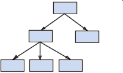

Vers le milieu des années 1960, les SGBD *réseaux* complètent les SGBD hiérarchiques. Une manière imagée de considérer cette nouvelle organisation des données et de la voir comme des arborescences avec des raccourcis.

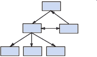

Enfin les SGBD *relationnels*, les plus utilisés aujourd'hui, arrivent sur le marché dans les années 1970. Les données y sont organisées sous forme de tableaux liés les uns avec les autres. Un langage standardisé, le SQL, est créé pour interragir avec les SGBD relationnels.

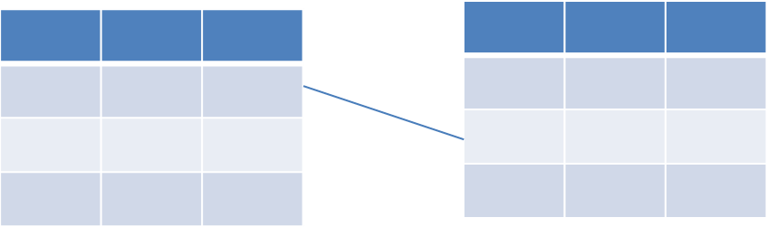

D'autres systèmes d'organisation des données connaissent leurs heures de gloire dans les décennies qui suivent. Citons par exemple les SGBD *orientés objets* (années 1990) qui répondent à une problématique de la programmation orientée objet en forte progression à cette époque.

A partir des années 2000, l'explosion d'internet et des réseaux de communication a de forts impacts sur les systèmes de gestion de bases de données. Prévus initialement pour fonctionner avec des dixaines ou centaines d'utilisateurs, les SGBD sont maintenant confrontés à des milliers, voir millions d'utilisateurs (pensons aux réseaux sociaux Facebook ou Twitter par exemple). Les volumes de données croissent également considérablement et ne permettent plus d'être stockés sur un seul ordinateur. Les SGBD historiques ne répondent pas de manière satisfaisante à ces utilisations exceptionnelles. Le concept de *base de données réparties* apparait à la fin des années 1980 : une base de données n'est plus nécessairement stockée sur un seul support physique, ce qui permet de rendre son accès depuis différentes localités plus facile.

La mouvance des bases de données *NoSQL* (Not Only SQL) vise également à répondre à la problématique de multiplication des usages[^1]. L'approche la plus commune consiste à les classer les bases de données NoSQL en quatre grandes familles : les bases de données *clé/valeur*, les bases de données *orientées documents*, les bases de données *orientés colonnes* et les bases de données *orientés graphes*.

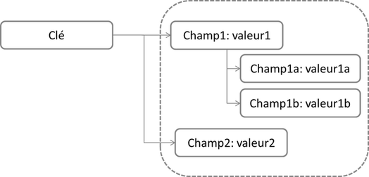

[^1]: pour l'étudiant intéressé, voir compléments en annexes

* Synthèse des grandes dates de l'histoire des SGBD :
	* 1956 : premier disque dur
	* 1964 : apparition du concept de base de données
	* 1964 : moteur de base de données réseau IDS de General Electric
	* 1966 : moteur de base de données hiérarchique IMS d'IBM
	* 1970 : thèse de E. Codd introduisant le modèle relationnel
	* 1974 : création du langage SQL
	* 1974 : première version de INGRES
	* 1977 : fondation de la société Oracle
	* 1990 : systèmes orientés objets
	* 1990 : bases de données réparties
	* 2000 : mouvence NoSQL

Aujourd'hui les SGBD se retrouvent dans de nombreux domaines et métiers. Citons par exemple :

* les banques, pionnières en matière de base de données réseau; 
* les producteurs de données, à l'image de l'Institut national de l'information géographique et forestière (IGN) dont le métier est de produir des bases de données géographiques; 
* les sites marchands sur internet; 
* les réseaux sociaux ou encore les moteurs de recherches qui, ces dernières années, ont fait avancer les technologies dans le domaines du NoSQL et du *big data*;
* et à une autre échelle : derrière chaque blog ou site sur internet se cache en général une base de données;
* etc.

Les SIG que nous utilisons en géomatique sont en un sens des SGBD destinés à la gestion de bases de données présentant une composante géographique.


Dans la suite de ce cours nous ne nous intéresserons qu'aux **systèmes de gestion de bases de données relationnelles (SGBDR)** qui sont apparus dans les années 1980 et constituent à ce jour la famille de SGBD la plus utilisée.


## La notion de transation ###
La notion de transaction est fondamentale en base de données.

> Une **transaction** est une séquence d'actions sur une base de données.

Elle peut débuter lorsque la base se trouve dans une état initial cohérent et amène toujours la base dans un état final respectant lui aussi la cohérence des données.

"M. Dupont effectue un virement de 500e sur le compte de M. Durant" est une transaction constituée de deux opérations :

* débiter le compte de M. Dupont de 500e;
* créditer le comptre de M. Durant de 500e.

Des règles et mécanismes propres à certains types de SGBD garantissent que les transactions sont exécutées de manière fiable :

* l'**atomicité** : une transaction est un ensemble d'instructions indivisibles;
* la **cohérence** : une transaction ne peut amener à violer une des contraintes de la base;
* l'**isolation** : deux transactions concurrentes ne peuvent intéragir entre elles;
* la **durabilité** : si une panne survient pendant une transaction, l'ensemble de la transaction doit être annulé.

Si nous reprenons l'exemple précédent du virement de 500e :

* la transaction est constituée de deux instructions indivisibles : un débit et un crédit. Si nous n'effectuons pas l'une ou l'autre des instructions, la transaction ne correspond plus à un virement;
* la somme totale d'argent possédée par l'ensemble des personnes est identiques avant et après la transaction : la transaction amène bien la base dans un état cohérent;
* si un autre virement est effectué en même temps, le système traitera les deux transactions indépendament l'une de l'autre : il n'y a pas d'interférence entre elles;
* si une panne survient entre le débit et le crédit, l'opération de débit peut être annulée (on crédite le compte de M. Dupont) pour ramener la base dans une état cohérent.

Une transaction qui respecte ces quatre règles est dite *ACID* (nous parlerons aussi d'*acidité* du SQGB). Les SGBD hiérarchiques comme relationnels offrent la garanti d'effectuer des transactions acides. Les systèmes NoSQL, apparus pour répondre à de nouvelles demandes (haute disponibilité, volumes de données énormes, etc.), offrent de nouvelles possibilités en terme de stockage et de performance en sacrifiant une part de leur acidité : les systèmes NoSQL ne garantissent plus systématiquement l'acidité des transactions.


\newpage

# Conception d'une base de données #

Dans cette partie, nous nous posons la question de comment concevoir une base de données relationnelle. Après avoir présenté les spécificités du modèle relationnel, nous introduirons la notation UML qui nous servira à représenter de manière schématique le monde réel à modéliser.

La conception d'un schéma n'est pas une tâche technique ardue. L'expérience permettra d'éviter certaines erreurs communes et de mettre en place rapidement les "bonnes" solutions, éprouvées sur d'autres configurations similaires.

Le processus de construction d'une base de données est un processus qui est classiquement découpé en plusieurs étapes, chacune correspondant à un niveau de préoccupation différent :

1. Le **schéma conceptuel** décrit le monde réel au travers de la problématique étudiée. Il n'est pas encore question à ce stade de SGBD ni même d'informatique, mais uniquement de décrire de manière "standardisée" le monde réel. 
2. Le **schéma logique** est une traduction du modèle conceptuel dans le modèle de la base de données. A cette étape, le choix du type de SGBD intervient (SGDB relationnel, réseau, orienté document, etc.).
3. Enfin le **schéma physique** correspond à l'enregistrement des données de la base de données dans le système d'exploitation de l'ordinateur. Cette étape peut faire intervenir le SGBD concrètement retenu pour l'implémentation (PostgreSQL, MariaDB ou Oracle pour une base de données relationelle par exemple).

La suite de cette partie se concentre sur l'élaboration de schémas logiques dans le cas des SGBD relationnels. Mais dans la pratique, nous mélangerons souvent les phases de conception des différents schémas pour établir le *modèle relationnel* de la base de donnée.

Remarque : la communauté historique des bases de données relationnelles privilégiait le *modèle entité-association* pour modéliser les bases de données. Aujourd'hui le *language UML*, très utilisé en programmation, l'est également pour le création de bases de données relationnelles. C'est ce formalisme que nous employerons pour décrire les schémas logiques. 


## Le modèle relationnel ##
Le modèle relationnel a été exposé pour la première fois par Emmanuel Codd dans sa thèse soutenue en 1970. Il repose sur la théorie mathématique des ensembles. En raison de sa fiabilité et grace aux opérations qu'il rend possible sur les données, c'est le type de base de données la plus utilisé actuellement.

### Fondements et propriétés ###
Dans le modèle relationnel, les données sont contenues dans des *relations*.

> Une **relation**, ou *table*, est un ensemble de données relatives au même sujet.

Il s'agit d'une sorte de contrat sur la forme attendue des données. 
Une relation est classiquement représentée sous la forme d'une table possédant à ce titre une **en-tête** et des **lignes** (nous parlerons aussi parfois de *tuples*).

A un autre niveau, la **colonne** est le constituant de base de la relation. Chaque colonne est caractérisée par un *nom* et un *domaine*. Le domaine d'une colonne permet de préciser des contraintes sur le contenu qui y est autorisé. Nous pouvons par exemple indiquer un type de données pour une colonne (texte, nombre entier, nombre à virgule, date, etc.) ainsi qu'une longueur et/ou précision pour les valeurs contenues (20 caractères, 32 bits, 5 décimales, etc.). Mais le domaine ne se limite pas à décrire le contenu de la colonne : il peut contenir des règles ou contraintes sur les valeurs qui y sont autorisées (valeur non nulle, inférieure à 10, date antérieure à la date du jour, etc.).

Exemple :

* La relation `VILLE` contient trois colonnes nommées :
	* `NOM`
	* `CODE_POSTAL`
	* `POPULATION`

Un représentation classique de cette relation sera : `VILLE(NOM, CODE_POSTAL, POPULATION)`

* Le domaine de la colonne `NOM` est le suivant :
	* Type : texte
	* Longueur : 100 caractères
	* Les caractères autorisés sont les suivants : 0-9, a-z, A-Z, caractères accentuées, espace, "- / ' &"
	* Valeur nulle non autorisée
	* Pas de valeur par défaut
* Le domaine de la colonne `CODE_POSTAL` est le suivant :
	* Type : texte
	* Longueur : 5 caractères
	* Les deux premiers chiffres doivent correspondre à un numéro de département
	* Valeur nulle non autorisée
	* Pas de valeur par défaut
* Le domaine de la colonne `POPULATION` est le suivant :
	* Type : nombre entier
	* Longueur : 32 bits (*valeur max = 4 294 967 295*)
	* Valeur nulle par défaut

Un exemple de relation `VILLE` résultante est donné ci-dessous :

| NOM              | CODE_POSTAL | POPULATION  |
|:-----------------|:-----------:|------------:|
| Paris            | 75000       | 2229621     |
| Champs-sur-Marne | 77420       | 24913       |
| Ajaccio          | 2A004       | 67507       |

### Notion de clé primaire et étrangère ###
Une autre notion fondamentale dans le modèle relationnel est celle de clé primaire et étrangère.

> Une **clé primaire** est une colonne, ou un groupe de colonnes, permettant d'identifier de manière unique une ligne dans une relation.

> Une **clé étrangère** est utilisée pour lier des relations entre elles. Il s'agit d'une colonne de la relation qui fait référence à une clé primaire d'une autre relation.

### Associations entre relations ###
Les types d'association possibles entre relations diffèrent par le nombre de lignes impliquées dans les différentes tables associées. Ce nombre d'objets impliqués est appelé **cardinalité**. Voici quelques exemples de cardinalité :

* **1-1** : *un pays a une capitale, et une capitale est dans un seul pays*
* **1-N** ou `1-*` : *un pays possède plusieurs villes, mais une ville n'est que dans un seul pays*
* **N-M** ou `*-*` : *un pays possède des frontières et ces frontières concernent plusieurs pays*

Dans le cas des liens *N-M*, il arrive qu'une information à stocker ne puisse être rattachée à aucune des deux tables impliquées. Prenons l'exemple d'une base de données où sont enregistrées les informations sur les personnes et les entreprises dans lesquelles elles travaillents. Notre base serait alors constituée de deux relations : `Personne` et `Entreprise`, avec chacune diverses colonnes permettant de caractériser ces objets. La cardinalité entre ces deux relations est de type *N-M* : une personne peut avoir plusieurs emplois et une entreprise emploie plusieurs personnes. Si l'on s'intéresse aux salaires touchés par une personne pour ses emplois, l'information ne peut pas être stockée dans la relation `Entreprise` : toutes les personnes d'une entreprise n'ont pas le même salaire. Mais elle ne peut pas non plus être stockées dans la relation `Personne` : une personne peut toucher des salaires différents pour chacun de ses emplois. L'information sur ce que gagne une personne pour un travail donné est intimmement liée à la relation entre `Personne` et `Entreprise`. Dans ce cas de figure, le modèle relationnel nous permet de créer une *table d'association*.

> Une **table d'association** est une relations apportant des informations sur une association.

Pour l'exemple précédent, nous ajouterions à notre modèle une relation `Travail` composée de 3 colonnes : `id_personne`, `id_entreprise` et `salaire`. `id_personne` et `id_entreprise` étant des clés étrangères faisant référence respectivement aux clés primaires de `Personne` et `Entreprise`. `salaire` est quand à elle une colonne de type nombre à virgule, dont la valeur ne peut être que positive.

### Parenthèse sur les types de données ###
Pour chaque colonne, nous précisons le type de la données stockées. Nous listons ici les types de données couramment rencontrés dans les SGBD[^2] :

[^2]: l'intitulé exact du type dépendra du SGBDR. C'est une information qui apparaîtra donc dans le schéma physique.

* Types numériques
	* Integer : entier relatif stocké sur 32 bits (valeur max = $2^{31}-1$)
	* Bigint : entier relatif stocké sur 64 bits (valeur max = $2^{63}-1$)
	* Float : nombre à virgule stocké sur 32 bits (valeurs permises -1.79E+308 à -2.23E-308, 0 et 2.23E-308 à 1.79E+308)
	* Real : nombre entier double précision stocké sur 64 bits (valeurs permises -3.40E+38 à -1.18E-38, 0 et 1.18E-38 à 3.40E+38)
* Caractères : 
	* Char : un unique caractère 
	* Character : suite de caractères de longueur fixe comprise entre 1 et 8000
	* Varchar : suite de caractères pour laquelle l'espace de stockage de chaque valeur peut être différent 
	* Text : texte de longueur indéterminée
* Booléen :
	* Boolean
* Dates et heures
	* Date : date seule
	* Time : heure seule
	* Datetime : date et heure
	* *les types dates et heures peuvent être avec ou sans fuseau horaire (timestamp)*
 
### Opérations de l'algèbre relationnelle ### 
L'intérêt principal du modèle relationnel est qu'il rend possible les opérations sur les relations et entre les relations. Ces opérations, au nombre de huit, produisent de nouvelles relations à partir de la ou des relations sur lesquelles elles s'appliquent.

Les opérations s'appliquent soit sur une seule relation :

* la sélection;
* le renommage;
* la projection.

Soit sur deux relations :

* l'union;
* l'intersection;
* la différence;
* le produit cartésien;
* la jointure.

Dans la suite, nous voyons dans le détail le résultat produit par ces opérations.

\newpage

#### La sélection ####
La sélection ne conserve que les lignes répondant à une condition.

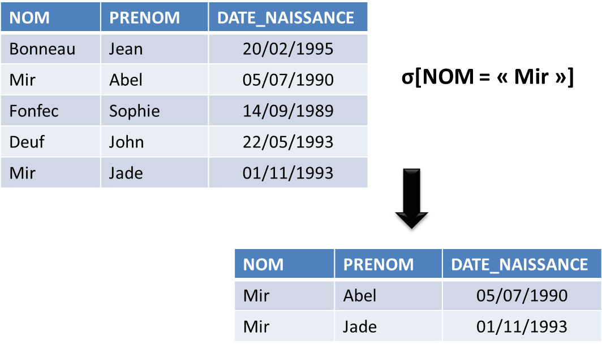

#### Le renommage ####
Le renommage modifie le nom d'une colonne dans une relation.

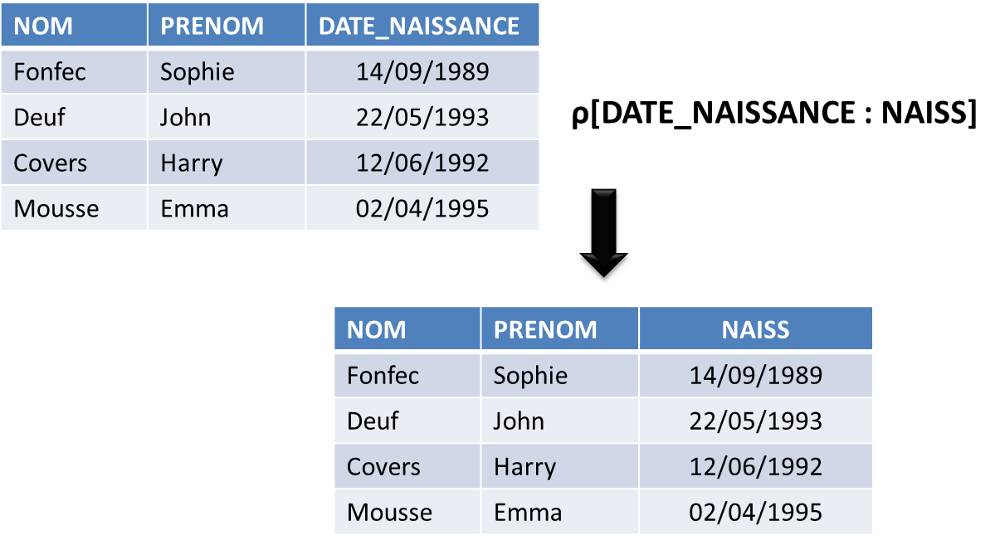

\newpage

#### La projection ####
La projection crée une nouvelle relation contenant l'ensemble des lignes d'une relation initiale, mais en ne conservant que certaines colonnes.

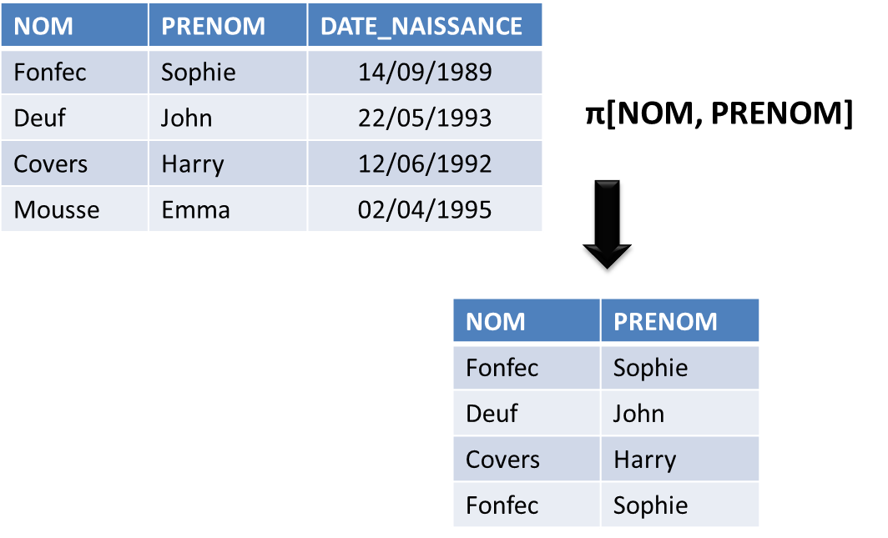

#### L'union ####
L'union réunit dans une même relation les éléments communs de deux relations initiales.

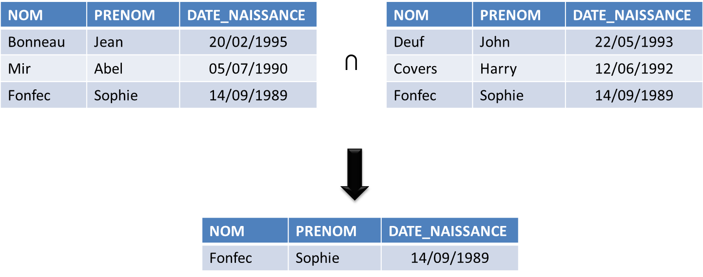

\newpage

#### L'intersection ####
L'intersection réunit dans une relation les éléments qui sont dans les deux relations initiales.

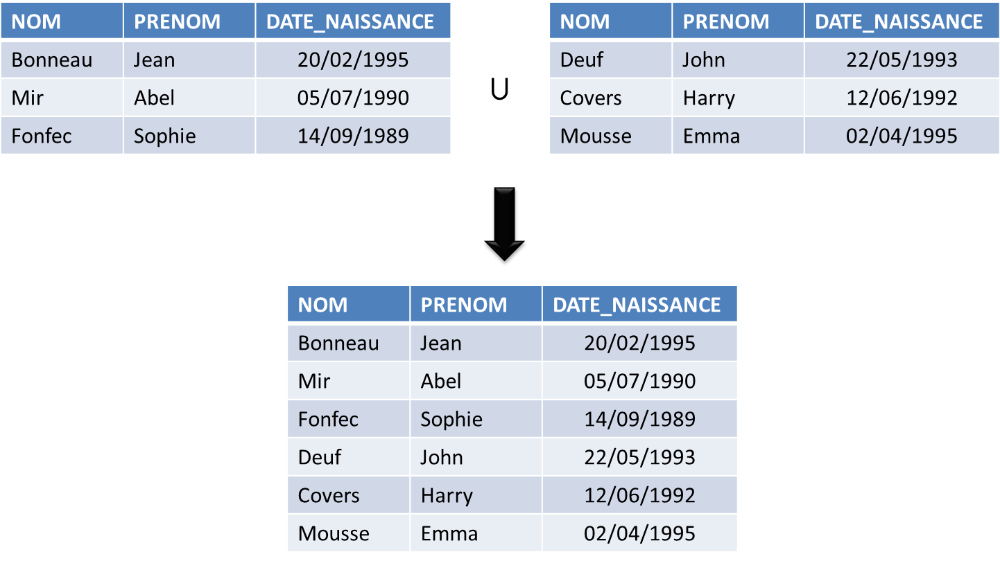

#### La différence ####
La différence réunit dans une relation les éléments d'une relation donnée qui ne se trouvent pas dans une autre.

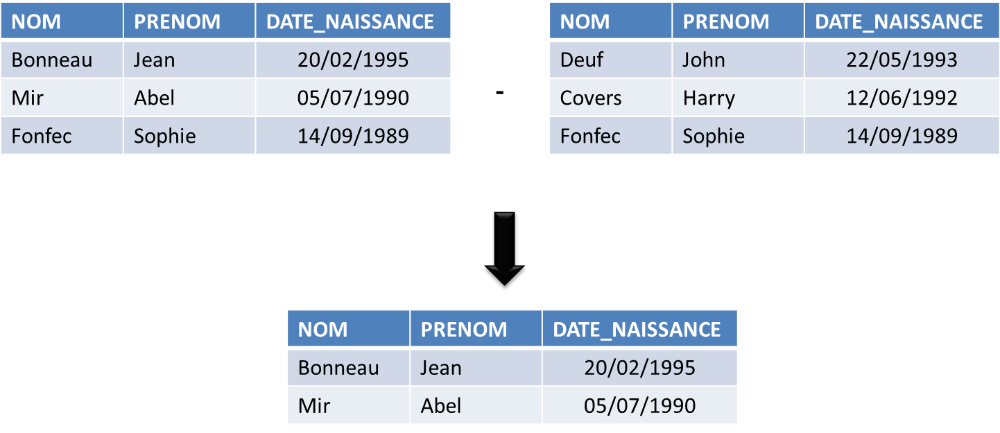

\newpage

#### Le produit cartésien ####
Le produit cartésient combine dans une relation les éléments de relations en entrée.

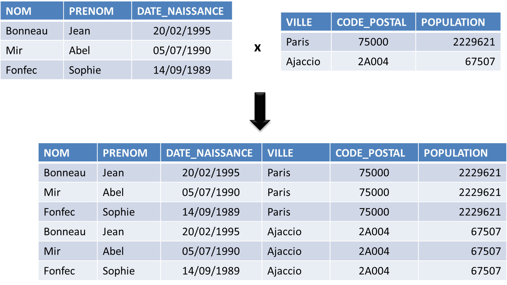

#### La jointure ####
La jointure combine dans une relation des éléments de deux relations répondant à un critère de jointure

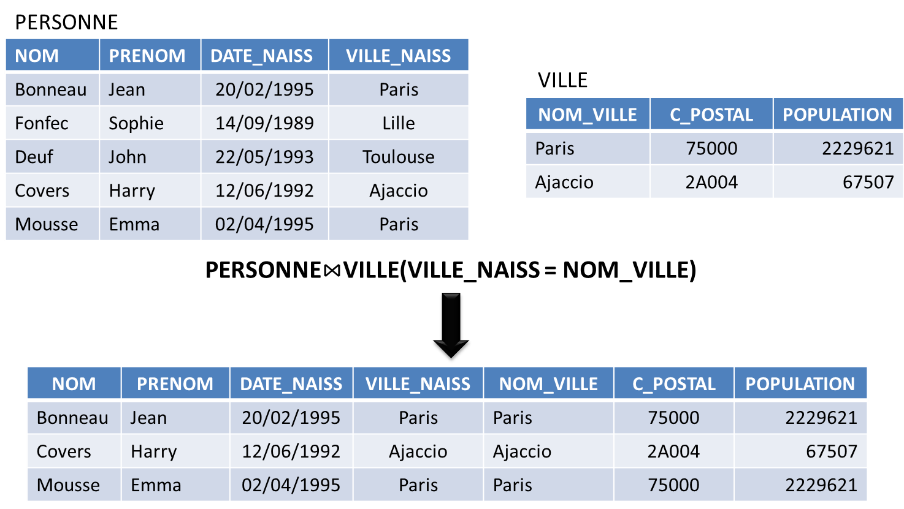

\newpage

### Exercices ###
#### Exercice 1 - Clés primaires et étrangères ####
*Remarque : chaque question ne doit pas vous prendre plus d'une minute. Il n'est pas nécessaire de rédiger proprement les réponses. C'est la réflexion que vous menez qui est intéressante.*

Nous considérons les relations `Ville` et `Personne` suivantes :

| NOM              | CODE_INSEE  | POPULATION  |
|:-----------------|:-----------:|------------:|
| Paris            | 75000       | 2229621     |
| Champs-sur-Marne | 77083       | 24913       |
| Ajaccio          | 2A004       | 67507       |

| NOM              | PRENOM      | DATE_NAISSANCE  |
|:-----------------|:-----------:|----------------:|
| Bonneau          | Jean        | 20/02/1995      |
| Mir			   | Abel        | 05/07/1990      |
| Fonfec           | Sophie      | 14/09/1989      |
| Deuf             | John        | 22/05/1993      |

1. Proposez une clé primaire pour la relation `Ville`. 
2. Même question pour la relation `Personne`.
3. En modifiant le modèle, comment traduire le fait qu'une personne est née dans une ville (mais plusieurs peuvent naître dans la même ville) ?
4. En modifiant le modèle, comment traduire le fait qu'une personne peut posséder des logements dans différentes villes ?

#### Exercice 2 - Représentation dans le modèle relationnel  ####
*Remarque : chaque question ne doit pas vous prendre plus de trois minutes. C'est l'idée générale de votre réponse qui est importante ici. Il n'est pas nécessaire qu'elle soit strictement identique à la correction.*

Nous souhaitons représenter dans une base de données l'ensemble des élèves de terminal d'un lycée en sachant qu'ils sont regroupés par classe.

Les élèves et les classes présentent diverses caractéristiques : le nom d'un élève, sa moyenne au bac en 1ère, la filière d'une classe (S, ES, L, etc.), le numéro de la classe au sein de l’établissement (T1, T4, etc.).

Nous voulons pouvoir rechercher facilement :

* les élèves appartenant à une même classe ;
* les élèves partageant un attribut commun, par exemple ceux ayant effectué leur terminale dans un lycée donné.

Prenons pour exemple trois classes d'un lycée nommé Jeanne d'Arc :

* T1S :
	* Léa (moyenne bac : 12)
	* Paul (moyenne bac : 10)
* T2ES :
	* Jean  (moyenne bac : 11,3)
	* Marion  (moyenne bac : 10,5)
* T3S :
	* Lilianne  (moyenne bac : 13,1)
	* Maxime  (moyenne bac : 17)

1. Pour commencer à établir le modèle conceptuel de la base, identifiez les entités qui interviennent dans le problème. Précisez leurs caractéristiques principales.
2. En utilisant le modèle relationnel, proposez un schéma logique représentant le problème décrit ci-dessus.
3. Explicitez les domaines pour deux des colonnes que vous avez identifées.

#### Exercice 3 - Opérations du modèle relationnel ####
*Remarque : temps de travail estimé = 2 minutes par question (ne pas passer plus de 5 minutes sur une question).*

Nous considérons les relations suivantes dans le modèle relationnel.

Relation `Riviere`, où `id` est une clé primaire de la relation.

| id | nom         | longueur |
|:--:|:------------|:--------:|
| 1  | Ourcq       | 87       |
| 2  | Marne       | 514      |
| 3  | Morbras     | 17,3     |
| 4  | Grand Morin | 118,2    |


Relation `Ville`, où `id` est une clé primaire de la relation et `port` un booléen (vrai/faux) indiquant si un port est présent dans cette ville.

| id | nom            | port  |
|:--:|:--------------:|:-----:|
| 1  | Coulommier     | false |
| 2  | Lizy-sur-Ourcq | false |
| 3  | Mary-sur-Marne | false |
| 4  | Meaux          | true  |

Relation `Traverse` dans laquelle un enregistrement est présent à chaque fois qu'une rivière traverse une ville. `idr` est une clé étrangère vers la clé primaire de `Riviere` et `idv` est une clé étrangère vers la clé primaire de `Ville`. `idr` et `idv` forment une clé primaire pour cette relation.

| idv | idr |
|:---:|:---:|
| 1   | 4   |
| 2   | 1   |
| 3   | 1   |
| 3   | 2   |
| 4   | 2   |

1. Quelle relation obtient-on en effectuant le produit cartésien des relations `Ville` et `Riviere` ? La table résultant est un peu grosse, inutile de l'écrire en entier si vous visualisez bien le résultat final, les 6-8 lignes suffisent. Quel est la signifiaction du résultat obtenu ?
2. Par quelle(s) opération(s) du modèle relationnel peut-on obtenir la relation suivante ?

| nom         | longueur |
|:------------|:--------:|
| Ourcq       | 87       |
| Morbras     | 17,3     |


3. Quel est le résultat de la jointure de la relation Ville avec la relation `traverse` en utilisant comme condition de jointure `Ville.id = Traverse.idv` ?

4. Quelle(s) opération(s) du modèle relationnel permettent d'obtenir la relation suivante ?

| Nom ville      | Nom rivière |
|:--------------:|:------------|
| Coulommier     | Grand Morin |
| Lizy-sur-Ourcq | Ourcq       |
| Mary-sur-Marne | Ourcq       |
| Mary-sur-Marne | Marne       |
| Meaux          | Marne       |


\newpage

## Modélisation à l'aide d'UML ##
A ce stade du cours, nous sommes capable de décrire de manière textuelle une relation en précisant, là encore de manière textuelle, les domaînes des différentes colonnes. C'est ce que nous avons fait lors des exercices en fin de partie précédente. Cette manière de procéder par descriptions textuelles ne sera satisfaisante que pour une ou deux petites tables, mais deviendra très vite laborieuse à mettre en oeuvre dès que la taille de la base augmentera (nombre de tables, nombre de colonnes).

L'apprentissage d'un formalisme standardisé va nous permettre de résoudre ce problème. 

### Généralités ###
**Unified Modeling Language** (UML) est un langage graphique utilisé pour la conception de programmes informatiques. Conçu initialement pour les besoins de la programmation orientée objets, ce langage graphique c'est aujourd'hui largement diffusé et est utilisé dans de nombreux domaînes informatiques. 

Deux caractéristiques ont contribué à sa démocratisation : les diagrammes UML sont facilement lisibles par un humain et sont interprétables par les ordinateurs. Il est ainsi possible de créer des programmes ou bases de données directement à partir de schémas réalisés en UML.

L'utilisation d'UML aboutit à la réalisation de diagrammes. Dans le cadre de ce cours, nous nous intéresserons au *diagramme de bases de données* (aussi appelé *diagramme de classes*).

### Syntaxe d'UML ###
Chaque relation est représentée sous la forme d'un rectangle constitué de deux cases. Le nom de la relation est écrit dans la case du haut, tandis que la liste des colonnes l'est dans la case du bas.

La syntaxe pour une colonne est `nom_colonne: type(longueur) {contraintes eventuelles}`. 

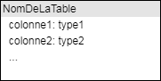

Les noms de la colonne ou des colonnes utilisés comme clé primaire sont soulignés. Ceux de colonnes correspondant à des clés étrangères sont précédés d'un `#`[^3].

[^3]: attention, certains utilisateurs d'UML ne respectent pas cette règle et l'on pourra ainsi rencontrer des représentations légèrement différentes des clés primaires et étrangères.


Lorsque les tables sont liées entre elles, il convient de tracer un trait entre elles. Les cardinalités des relations sont indiquées de chaque coté du trait.

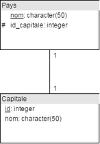

Pour aider le lecteur, nous pouvons ajouter des précisons textuelles sur le lien.

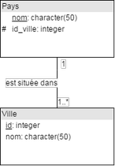

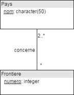

La représentation pour les tables d'association est identique à celle des table classiques. Elles sont liées aux liens par des traits en pointillets.


### Agrégation, composition ###
UML permet d'indiquer qu'une entité est une partie d'un autre entité. Nous parlons alors de relations de *composition* ou d'*agrégation*. Par exemple : une rivière est composée de tronçons de cours d'eau. 

Ce type de relation n'a pas de sens particulier dans le modèle relationnel (elles sont traduites comme des relations simples). Il permet uniquement d'ajouter des informations dans le modèle UML et d'en faciliter la lecture et compréhension.

UML permet de nuancer la nature de la composition. La **relation d'agrégation** est représentée par un trait se terminant par un losange blanc du côté de l'agrégat. Il s'agit d'une *agrégation simple* d'entités.

La **relation de composition** est quand à elle représentée part un trait se terminant par un losange blanc du côté de l'agrégat. Elle caractérise une *agrégation forte*, au sens où elle ajoute des contraintes sur le cycle de vie des entités : unicité de l'appartenance, disparition des objets composants (les *parties*) avec la disparition de l'objet composé (le *tout*).

Par exemple, une école est composée de cycles et est aussi composée d'étudiants. Pour autant, la relation école-cycle n'est pas de même nature que école-étudiant : si on supprime l'école, on supprime également les cycles : c'est une relation de composition. Mais les étudiants ne disparaissent pas si l'on supprime l'école : c'est une relation d'agrégation.

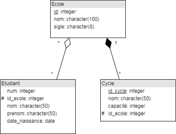

Autre exemple, une maison est une agrégation de murs. Il n'y a pas unicité d'appartenance (un même mur peut être partagé par plusieurs maison). Et si l'on détruit la maison, les murs ne sont pas pour autant tous supprimés. De même un mur peut exister sans appartenir forcément à une maison. En revanche la maison est composée de fenêtres : il y a unicité d'appartenance (une fenêtre ne peut pas être dans deux maisons à la fois) et la destruction de la maison entraîne la destruction de toutes ses fenêtres.

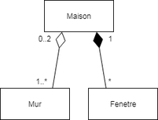

\newpage

### Exercices ###
Pour répondre aux questions de modélisation à l'aide d'UML, vous pouvez utiliser un papier et un crayon ou un logiciel adapté[^4]. 

[^4]: draw.io, Modelio, StarUML, etc. (voir liste en annexe)

#### Exercice 4 - Massifs montagneux ####
*Remarque : temps de travail estimé = 10-12 minutes (ne pas passer plus de 20 minutes sur cet exercice).*

Un massif montagneux est composé de sommets à différentes altitudes. Le massif, comme chacun des sommets, possède un nom qui est unique. Un sommet, localisé par sa longitude et sa latitude, est situé sur un seul pays. Ce n'est pas forcément le cas du massif complet qui peut s'étendre sur plusieurs pays.

Des voies d'accès d'escalade permettent parfois de gravir un sommet. Ces voies peuvent être nommées et sont toujours caractérisées par leur difficulté (exemple : 1A, 1B, 1C, 2A, ... 7C). Pour retrouver la trace d'une voie, les cordonnées de points remarquables la constituant sont enregistrées. Un point peut être utilisé pour plusieurs voies d'accès. Enfin, un texte libre compléte parfois la description du point remarquable.

1. Parmi les propositions suivantes, identifiez les entités qui constitueront les relations du système à modéliser : massif, randonnée, escalade, pays, altitude, difficulté, voie d'accès, point remarquable, point secondaire, sommet, surface, coordonnée, description.

2. Quel sera la cardinalité de la relation *voie d'accès*-*point remarquable* ? Au choix : 1-1, 1-N ou M-N. 

3. Pour établir le modèle logique à l'aide UML, nous vous fournissons une structure à compléter. Créez un nouveau document dans draw.io et chargez le modèle UML `Massif_montagneux_a_completer.xml` (menu File > Open from > Device). Il vous reste à indiquer les colonnes consituant les différentes relations et les cardinalités entre ces relations.

#### Exercice 5 - Association de randonneurs ####
*Remarque : Temps de travail estimé = 20 minutes (ne pas passer plus de 35 minutes sur cet exercice). En cas de blocage, des indices peuvent vous guider (ne pas regarder les indices au bout de 30 secondes).*

Une association de randonneurs souhaite mettre en place une base de données qui permettra à ses adhérents de consulter via un site internet les possibilités de randonnées qui respectent des critères tels que :

* le temps et la difficulté du parcours;
* le fait de vouloir faire une boucle ou non;
* la zone géographique;
* les possibilités d'hébergement.

Une randonnée est décrite sous forme d'étapes qui sont caractérisées par les points suivants :

* le nom d'un lieu remarquable (village, lieu-dit, croisement de chemin, col, chapelle, etc.);
* le temps de parcours de l'étape (ie. temps pour arriver au lieu remarquable depuis le lieu remarquable précédent);
* la distance et/ou le dénivelé de l'étape;
* une description textuelle de l'étape (chemins à emprunter, difficultés particulières, etc.) sous forme d'un court paragraphe;
* éventuellement, des informations sur ce que l'on peut trouver à proximité de l'étape, notamment en termes de ravitaillement ou de logement.

Bien sûr, pour chaque étape, le futur randonneur peut accéder à une carte de l'itinéraire sur un fond de plan IGN au 1/25000ème[^5]. Pour la randonnée complète, un assemblage des cartes des étapes est disponible.

Une étape peut être empruntée par plusieurs randonnées.

[^5]: dans la base de données, nous nous contenterons de sauvegarder le chemin d'accès à la carte de la randonnée.

L'association dispose également d'une liste d'hébergements avec les notes (entre 0 et 5) et les commentaires nominatifs des adhérents y ayant déjà séjourné.

=> Proposez une modélisation du problème en utilisant le formalisme UML.

\begin{note}
\textbf{Ne lire ces indices qu'après avoir déjà réfléchi 5 minutes au moins au sujet!}

\vspace{1em}

Nous identifions initialement quatre objets intervenant dans le problème à décrire : les randonnées, les étapes, les hébergements et les avis sur les hébergements.

Une randonnées est composée d'étapes qui peuvent appartenir à plusieurs randonnées. Le lien entre étape et randonnée est de cardinalité M-N.

Un hébergement se trouve sur une étape mais il peut y avoir plusieurs hébergement pour une étape. Le lien est de cardinalité 1-N. 

Il nous reste enfin à intégrer les avis sur les hébergements. Ceux-ci étant nominatifs, nous décidons d'ajouter une table pour représenter les adhérents de l'association. Cet table nous permettra de retrouver tous les avis d'un adhérent donné.

Les avis sont ajoutés sous forme de table d'association liant les adhérents et les hébergements. La cardinalité entre ces deux table des de type M-N : un adhérent peut évaluer plusieurs hébergement et un hébergement peut être évalué par plusieurs adhérents.
\end{note}

\newpage

## Conseils pour bien modéliser - Cas des objets géographiques ##
* La modélisation consiste à créer une représentation virtuelle d'une réalité de manière à faire ressortir les points auxquels nous nous intéressons.
* Faire simple au début : commencer par modéliser le cas général sans chercher à rentrer dans les détails particulier. Préciser ensuite les détails du cas général.
* Pour modéliser de manière pertinente, il peut être nécessaire de s'appuyer sur les connaissances des experts métiers. Le modèle conceptuel est le fruit de la collaboration entre des experts métiers et informaticiens.
* Une modélisation sera d'autant plus pertinent qu'elle anticipe et permet les évolutions futurs du modèle (là encore la connaissance des experts métiers est indispensable).
* A ce titre, il est préférable également de choisir une clé primaire "neutre". Elle ne doit pas être modifiable et doit caractériser de manière unique une occurence. Mais utiliser un ensemble de colonnes peut rendre l'utilisation assez lourde.
* Dans le cas de données géographiques, stocker des valeurs issus de la géométrie est rarement pertinent (longueur d'une ligne, surface d'un polygone, etc.) : les SIG possèdent des fonctionnalités permettant de calculer toutes ces valeurs. Un unique attribut portant la géométrie est suffisant.
* Le choix du type de géométrie est intimement lié à l'usage qui sera fait de la base de données.

\begin{note}
Les types de géométrie reconnus dans la plupart des systèmes sont : point, multi-point, linistring (ligne), multi-linestring, polygon (polygone avec trous), multi-poygone, collection (ensemble de géométries de types différents). Exemples : 

\begin{itemize}
\item une ligne de bus est modélisée par une table possédant une colonne géométrie de type ligne;
\item une commune est modélisée par une table possédant une colonne géométrie de type polygone dans une base destinée à un usage local (l'aménagement d'un territoire par exemple);
\item la même commune sera modélisée par une table avec une colonne géométrie de type point si la base est uniquement utilisée pour des besoins à petite échelle (cartographie France entière par exemple).
\end{itemize}
\end{note}

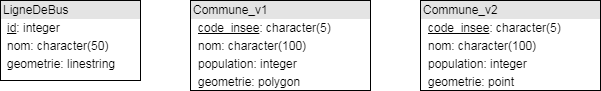

\newpage

### Exercice 6 ###
*Remarque : Temps de travail estimé = 20-30 minutes.*

Un service technique départemental souhaite enregistrer dans une base de données les informations sur l'état des routes de sont département afin d'en faciliter la gestion. 

Une route (ex : départementale D702, voie communale C12) est composée de différents tronçons linéaires, avec pour chacun un numéro, un nombre et une largeur de voie. Chaque tronçon commence et se termine obligatoirement par un noeud routier (un carrefour s'il relie plusieurs tronçons, une impasse sinon).

Les interventions des services techniques sont enregistrées dans la base de données (date, nature de l'intervention, tronçons impactés). De cette manière, un historique des interventions pour chaque tronçon est disponible.

Dans une visée de gestion des équipements, un dernier éléments important à prendre en compte concerne les franchissements de tronçons les uns au dessus/dessous des autres, sans qu'il y ait nécessairement de croisement. Ces franchissements sont nommés, typés (tunnel ou pont) et localisées précisément (coordonnées de l'intersection). La base de données doit permettre de retrouver quel tronçon passe au dessus de quel autre.

=> Vous proposerez à l'aide du formalisme UML une modélisation de système à représenter dans la base de données. Nous vous encourageons à accompagner votre diagramme de commentaires permettant de mieux comprendre les choix de modélisation effectués. Les types des objets géométriques apparaîtrons dans le diagramme.


\newpage

# Le langage SQL #

## Introduction ##
La première partie du cours s'est concentrée sur la modélisation d'une base de données relationnelle. A l'issue de la phase de modélisation, nous sommes capable d'établir un modèle de données, qu'il nous reste à implémenter dans une base de données pour pouvoir profiter de toute la puissance de cet outil.

En informatique, une *architecture client-serveur* désigne un mode d'organisation ou de déploiement d'applications sur un réseau : une application, qualifiée de **client**, envoie des requêtes, tandis que l'autre, qualifiée de **serveur**, attend les requêtes des clients, les traite et retourne une réponse.

L'utilisation d'un SGBD respecte cette architecture client-serveur. Le serveur est le SGBD proprement dit. L'utilisateur du SGBD envoie depuis des applications clientes des requêtes au serveur. 

Dans le cas des bases de données relationnelles, l'envoi de requêtes au serveur se fait sous forme normalisée en s'appuyant sur le **Structured Query Language** (SQL). Ce langage peut être utilisé pour tous les types de communication avec une base de données rélationnelle : définition de la structure, recherche d'éléments, ajout ou modification de données, etc.

Créé et utilisé pour la première fois en 1974, le langage SQL a été normalisé pour l'ensemble des SGBD relationnels en 1986 (version dite *SQL-86*). La norme a ensuite été révisée plusieurs fois : le *SQL-92* (ou *SQL2*) sera longtemps utilisé; la dernière version étant le *SQL-2011* adoptée en décembre 2011. Notons par ailleurs que si la nomre SQL est adoptée par la plupart des SGBD relationnels, ils proposent également tous des extensions de cette norme pour traiter des cas particuliers.

\begin{note}
Remarque sur la syntaxe employée dans la suite du cours :

* Les commandes SQL seront systématiquement écrites en majuscule : il s'agit juste pour facilier la lecture, SQL est insensible à la casse.
* Dans une syntaxe générale, une expression entre crochets `[...]` correspond à une partie optionnelle. 

L'ensemble des exemples de la suite de cette partie constitue un scénario cohérent qui peut être répété par l'étudiant.
\end{note}

## Création d'une table ##
La syntaxe pour créer une table est  :
```
CREATE TABLE nom_table (colonne1 type1 [contrainte], colonne2 type2 [contrainte], ...);
```

Où les contraîntes possibles peuvent être :

* `NOT NULL` : un attribut doit toujours avoir une valeur (ie. sa valeur ne peut être `NULL`; cela n'empèche pas d'être égal à 0 ou à une chaîne de caractères vide `""`)
* `PRIMARY KEY` pour indiquer qu'une colonne fait office de clé primaire 
* `REFERENCES` pour indiquer la colonne de référencéepar une clé étrangère 
* `UNIQUE` : deux lignes ne peuvent contenir la même valeur (cette contrainte ne s'applique pas aux valeurs `NULL`)
* `CHECK` : pour indiquer une règle à vérifier (par exemple : supérieur à, inférieur à...)

Considérons le modèle suivant décrivant une base composée de deux tables : `Region` et `Departement` (une région est composée de plusieurs départements)

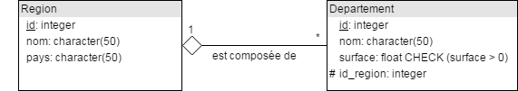

La requête pour créer la table `Région` sera :
```
CREATE TABLE Region (id integer PRIMARY KEY, 
					 nom varchar(50) NOT NULL, 
					 pays varchar(50));
```

La requête pour créer la table `Departement` sera :
```
CREATE TABLE Departement (id integer PRIMARY KEY, 
						  nom varchar(50) NOT NULL, 
						  surface float CHECK(surface > 0), 
						  id_region integer REFERENCE Region(id));
```

Pour ce qui est des clé primaires et étrangères, elles peuvent être indiquées sous forme de contrainte comme montré précédement, ou à la fin de la déclaration :
```
CREATE TABLE Departement (id integer, 
						  nom character(50) NOT NULL, 
						  surface float CHECK(surface > 0), 
						  id_region integer,
						  PRIMARY KEY (id),
						  CONSTRAINT dep_fk FOREIGN KEY (id_region) REFERENCE Region(id)));
```

Cette possibilité est notament utile lorsque la clé implique plusieurs colonnes (exemple : création d'une clé primaire sur le nom et le prénom des employés d'une entreprise) :
```
CREATE TABLE Employe (nom character(50),
					  prenom character(50),
					  salaire float,
					  PRIMARY KEY (nom, prenom));
```


## Modification du schéma ##
Bien souvent, nous avons besoin de modifier le schéma d'une table après l'avoir créée. En SQL, une requête de modification de la structure d'une table utilisera l'instruction clé `ALTER TABLE`. La syntaxe générale, pour toutes les modifications sera :
```
ALTER TABLE nom_table ACTION description
```

La suite de cette partie donne la syntaxe des différentes modifications possibles.

### Suppression/ajout d'une colonne
```
--suppression--
ALTER TABLE nom_table DROP COLUMN colonne;

--ajout--
ALTER TABLE nom_table ADD COLUMN colonne type {contrainte};
```

Par exemple, nous supprimons la colonne `id` de la table `Departement` précédement créée et la redéfinissons en utilisant une colonne de type `serial` (entier auto-incrémenté; type spécifique à PostgreSQL) :
```
ALTER TABLE Departement DROP COLUMN id;
ALTER TABLE Departement ADD COLUMN id serial PRIMARY KEY;
```

### Ajout d'une contrainte
```
ALTER TABLE nom_table ADD CONSTRAINT nom_contrainte contrainte;
```

Par exemple, nous précisons que le nom d'un département doit être unique :
```
ALTER TABLE Departement ADD CONSTRAINT unique_nom UNIQUE (nom);
```

### Suppression d'une table
```
DROP TABLE nom_table;
```

Par exemple, pour supprimer la table `Empoye` :
```
DROP TABLE Employe;
```


## Mises à jour des données ##
Nous avons vu dans la partie précédente comment traduire en SQL un modèle relationnel. Nous pouvons maintenant étudier la manière d'insérer, modifier ou encore supprimer des éléments dans une table.

### Insertion ###
```
INSERT INTO nom_table (colonne1, colonne1, ...) VALUES (valeur1, valeur2, ...);
```

Nous indiquons les noms des colonnes pour lesquelles nous connaissons les valeurs à insérer. La valeur des autres colonnes restera à `NULL`. 


Dans l'exemple ci-dessous, nous ajoutons l'Occitanie dans la table `Region`, puis l'Arriège dans la table `Departement`. 
```
INSERT INTO Region (id, nom) 
VALUES (1, 'Occitanie');

INSERT INTO Departement (id_region, surface, nom) 
VALUES (1, 4890, 'Arriège');
```

Notons que nous n'indiquons pas le pays de l'Occitanie ni l'identifiant de l'Arriège. La pays restera vide, mais l'identifant sera rempli automatiquement car nous avons utilisé le type `serial` pour cette colonne. Vous remarquerez également que l'ordre des colonnes n'a pas d'importance : il faut uniquement s'assurer que les colonnes et les valeurs à insérer sont passées dans le même ordre.

### Modifications ###
```
UPDATE nom_table SET colonne = valeur WHERE condition;
```

Par exemple, nous indiquons que le pays de l'Occitanie (région dont l'id vaut 1) est la France :
```
UPDATE Region SET pays = 'France' WHERE id=1;
```

### Suppression ###
```
DELETE FROM nom_table WHERE condition;
```

Nous ajoutons une région NoWhereLand que nous supprimons ensuite :
```
-- insertion
INSERT INTO Region (id, nom, pays) 
VALUES (2, 'NoWhereLand', 'NoWhereCountry`);

-- suppression
DELETE FROM Region WHERE id=2;
```


## Opérations sur une seule table ##
Nous nous intéressons dans cette partie à la traduction dans le langage SQL des opérations l'algèbre relationnel étudiées au début de cours. Nous commencerons par les opérations n'impliquant qu'une seule table (projection, sélection et renommage) et dans la partie suivante nous nous intéresserons aux opérations impliquant plusieurs tables.

### Projection ###
```
SELECT colonne1, colonne2, ... FROM nom_table;
```

Pour projeter sur toutes les colonnes, nous pouvons utiliser `*` :
```
SELECT * FROM nom_table;
```

Vous pouvez par exemple sélectionner les noms des régions :
```
SELECT nom FROM Region;
```

Ou toutes les informations sur les départements :
```
SELECT * FROM Departement;
```

### Sélection ###
```
SELECT * FROM nom_table WHERE condition;
```

Par exemple, nous sélectionnons le département dont l'identifiant est 1 :
```
SELECT * FROM Departement WHERE id = 1;
```

Pour les conditions portant sur des chaînes de caractères, l'opérateur à utiliser est `LIKE`. Le symbole `%` est utilisé pour indiquer "n'importe quel caractère".  Dans la requête suivante, nous sélectionnons les régions dont le nom commence par O :
```
SELECT * FROM Region WHERE nom LIKE 'O%';
```

Il est bien entendu possible de combiner sélection et projection.
```
SELECT colonne1, colonne2 FROM nom_table WHERE condition;
```

Dans ce cas, la condition de sélection ne peut porter que sur une colonne retenue par la projection.
```
SELECT nom, pays FROM Region WHERE nom LIKE 'O%';
```

### Renommage ###
```
SELECT colonne1 AS alias1, colonne2 AS alias2 FROM nom_table;
```

Par exemple :
```
SELECT nom AS 'Nom de Region', pays AS 'Nom de pays' FROM Region;
```

Il bien entendu est posible de combiner un renommage avec une sélection et/ou une projection.


## Opérations sur plusieurs tables ##
Nous en arrivons enfin aux opérations de l'algèbre relationnel impliquant plusieurs tables.
 
### Produit cartésien ###
```
SELECT * FROM nom_table1, nom_table2;
```

La requête suivante retourne par exemple toutes les combinaisons possible des éléments des tables `Region` et `Departement` :
```
SELECT * FROM Region, Departement;
```

### Jointure ###
```
SELECT * FROM nom_table_g JOIN nom_table_d ON condition_de_jointure;
```

Nous affichons les départements avec la région correspondante :
```
SELECT * FROM Departement JOIN Region ON Departement.id_region = Region.id;
```

### Autres opérations ensemblistes ###
Union
```
SELECT region FROM Station
UNION
SELECT region FROM Client
```

Intersection :
```
SELECT region FROM Station
INTERSECT
SELECT region FROM Client
```

Différence
```
SELECT region FROM Station
EXCEPT
SELECT region FROM Client
```


## Agrégation, ordonancement et autres requêtes avancées ##
Agrégation possibles : COUNT(), AVG(), MIN(), MAX(), SUM()
```
SELECT COUNT(*) FROM nom_table WHERE condition;
```

Agrégation en partitionnant le résultat en groupes et en appliquant l'agrégation à chaque groupe :
```
SELECT colonneI, ... FROM nom_table GROUP BY colonneI;
```

Ordonancement :
```
SELECT * FROM nom_table ORDER BY colonneI;
```


## Exercices ##
### Exercice 7 ###
Un club d'oenologie enregistre les résultats des dégustations qu'il organise avec ces adhérents afin d'effectuer des analyses permettant de proposer les vins les plus appréciés lors des sessions suivantes.

L'association possède le nom, le prénom, l'âge et la ville de résidence de chaque adhérent. Et son responable note pour l'instant sur un cahier à chacune des dégustations qu'il organise la date, les participants, les vins dégustés (appelation, millésime, degré, cépage principal, quantité consommée) ainsi que les impressions (sous forme de note allant de 1 à 5).

Afin d'améliorer les propositions de dégustations, elle souhaite mettre dans une base de données toutes ces informations. Nous avons à ce titre établit le modèle conceptuel suivant : 


En utilisant le langage SQL, écrivez les requêtes permettant d'effectuer les actions suivantes :

1. création de la table Buveur
2. suppression de la colonne `naissance` de la table `Buveur`
3. ajout de la colonne `naissance` à la table `Buveur` en y ajoutant une contrainte pour qu'un buveur ne puisse pas avoir moins de 18 ans
4. ajout du *Pinot Noir* dans la table `Cepage`
5. ajout dans la table des buveurs de Abel Mir, né en 1990 et résidant à Bordeaux
6. affichage des buveurs
7. affichage du nom de cru des vins
8. affichage des buveurs dont le nom est *Mir*
9. affichage des cépages dont le nom commence par un *M*
10. affichage du prénom des buveurs nés avant 1992
11. affichage des vins et leur cépage
12. affichage du prénom des buveurs ayant participé à la dégustation du *07/05/2015*
13. affichage des vins dégustés par le buveur d'identifiant 3 à la dégustation du *07/05/2015*
14. affichage, pour la dégustation du *07/05/2015*, de la note de chaque dégustation, en les triant dans l'ordre croissant, avec les nom/prénom du buveur, ainsi que le cru et le millésime du vin
15. passage de la ville de résidence de Deuf John de *Toulouse* à *Dijon*
16. suppression des dégustations ayant eu lieu le *12/12/2012*


\newpage

# Annexes #

## Le NoSQL ##
Les technologies NoSQL sortent du cadre de ce cours. Néanmoins, nous invitons l'étudiant intéressé par cette problématique à consulter les documents suivants :

* *Un déluge de données* : <https://interstices.info/jcms/ni_76920/un-deluge-de-donnees>, pour prendre conscience de ce que l'on entend par l'explosition des volumes de données traités par certains systèmes informatiques;
* Le texte recopié ci-dessous, extrait du MOOC *Bases de données relationnelles : Comprendre pour maîtriser* (plateforme [Fun MOOC]<https://www.fun-mooc.fr/courses/inria/41008S02/session02/691a55b8e3fc4c3582116eb10deb64e2/>), qui explique les raisons des limites des systèmes relationnels et les solutions apportées par les systèmes NoSQL. Texte disponible sous Licence Creative Commons BY-NC-ND 

Depuis des années, SQL (Structured Query Language) est le langage standard normalisé pour interroger et mettre à jour des bases de données relationnelles. Il s'est imposé jusque dans les systèmes pour construire des sites Web, avec PHP-MySQL. Mais les exigences d'applications « extrêmes » ont conduit à remettre en question sa suprématie. On retrouve des demandes difficiles à satisfaire avec des systèmes relationnels dans deux grandes classes d'applications :

* Applications transactionnelles : on peut avoir des millions de transactions à traiter par seconde, et ce vingt-quatre heures sur vingt-quatre. C'est le cas par exemple pour des sites de E-commerce comme Amazon.
* Applications décisionnelles : on doit réaliser des calculs, notamment statistiques, sur des téraoctets de données. C'est le cas par exemple pour des sites de recommandation comme Netflix.

Enfin, certaines applications, comme le *trading haute-fréquence* (ou trading algorithmique) marient les contraintes du transactionnel (volume important de transactions, besoin évident de rapidité) et du décisionnel (calculs complexes à mettre en œuvre avant de prendre la décision d'acheter ou vendre).

Quand on utilise les bons vieux systèmes relationnels sur de telles applications, ça rame... Quand on essaie de comprendre pourquoi, on réalise que les systèmes relationnels paient un fort *overhead* pour leur universalité, c'est-à-dire le fait qu'ils sont destinés à traiter tout type d'application, avec des données très diverses dans leur représentation, dans leur structure et leur volumétrie. Les difficultés rencontrées pour les applications mentionnées ci-dessus ont conduit à considérer des systèmes de gestion de données spécialisés qui passent à l'échelle des grands systèmes transactionnels ou décisionnels, mais en abandonnant cette universalité.

Les systèmes relationnels permettent par exemple à plusieurs utilisateurs de partager des données de manière contrôlée grâce à un système de verrous; la pose de verrou sur une donnée ou sur un morceau d'index particulier par une application garantit qu’aucune autre application ne va toucher cette information. Ce système de verrous est essentiel pour assurer des propriétés fondamentales comme la cohérence d’une base de données et de son évolution, mais il est aussi complexe et coûteux en temps. On peut améliorer les performances en le remplaçant par un protocole de partage moins sûr mais plus performant. Dans le cadre des systèmes distribués, un théorème proposé par Eric Brewer vient encourager un tel abandon. Le Théorème CAP explique qu'il est impossible de répondre aux trois exigences suivantes à la fois :

* *Cohérence* (**c**onsistency) : la valeur d'une donnée à un instant donné est la même pour chaque participant au système;
* *Disponibilité* (**a**vailability) : une donnée doit toujours être accessible même en cas de panne;
* *Tolérance* au **p**artionnement : le système doit continuer à fonctionner même quand il est fragmenté par des problèmes de réseaux.

Dans des situations très distribuées, comme c'est le cas pour des applications qui travaillent à l’échelle du Web, on peut choisir d'abandonner les exigences strictes en terme de cohérence (résumées par les propriétés ACID des transactions) au profit de la fluidité d'une exécution transactionnelle massive.

Une autre particularité fréquente des systèmes NoSQL est de s'appuyer sur des modèles de données plus simples que le modèle relationnel, des langages plus simples que SQL. Par exemple, plutôt que de considérer des tableaux à plusieurs colonnes, on va se limiter à associer des valeurs à des clés (comme dans un dictionnaire). On va aussi tirer un trait sur des opérations complexes comme la « jointure ». Quand on fait tout ça, on aboutit à des systèmes d'une grande pauvreté en termes de puissance de représentation et d'interrogation. C'est de là que vient le nom « No SQL » : ce n'est pas qu'on est « contre » SQL, mais plutôt qu'on n'est « même pas » SQL et qu'on en est fier! Certains préfèrent comprendre le sigle comme « Not only SQL ». Doit-on alors comprendre qu'on est au delà de SQL ou que SQL n'est pas la solution à tout? Dans le fourre-tout du NoSQL, on peut d'ailleurs trouver des propositions de modèles très spécialisés qui sur certains aspects sont plus riches que le modèle relationnel (par exemple pour représenter des graphes), avec des langages, eux aussi très spécialisés, qui proposent des opérations qui n’existent pas en SQL.

Mais nous nous intéressons surtout ici aux systèmes moins universels mais avec les performances extrêmes demandées. Ce n'est pas par miracle que ces systèmes arrivent à ces performances étonnantes : ils sont plus rapides parce qu'ils font moins de choses. C'est comme ça qu'on arrive à des passages à l'échelle de PétaOctets de données, de millions de transactions simultanées. C'est aussi parce qu'ils s'appuient typiquement sur des architectures massivement parallèles. La simplification des modèles trouve d'ailleurs là sa principale motivation : simplifier pour pouvoir paralléliser et donc passer à l'échelle d'infrastructures s'appuyant sur des milliers, voire des millions de machines. Parfois, le concept même de machine devient obsolète, et ce sont des (réseaux de) cartes graphiques (processeurs intrinsèquement massivement parallèles, mais aux propriétés de calculs bien spécifiques) qui sont utilisés. Le NoSQL s'est donc imposé dans le monde du Big Data et dans celui des applications Web démesurées.

Si les systèmes NoSQL connaissent de grands succès, il faut bien être conscient de ce tout qu'on perd. Ce qu'un système de gestion de données ne fait pas, c'est à l'application de le prendre en charge. On ne dispose pas des langages de haut niveau si pratiques pour déléguer la gestion des données à des systèmes évolués. Avec un système NoSQL qui ne sait faire (certes, efficacement) que des `put()` et des `get()`, il faut écrire du code relativement bas niveau et complexe pour la moindre fonctionnalité que l'on souhaite introduire, le moindre contrôle que l’on veut garantir, la moindre mise à jour, etc. Tout cela représente potentiellement des pertes énormes de productivité, de fiabilité, et même d’efficacité (les systèmes relationnels, quoiqu'on en dise, savent faire des choix d'exécution intelligents, performants et adaptés au contexte).

L'engouement actuel pour ces systèmes mal connus, mal compris, non normalisés, dont on peut penser parfois à tort qu'ils représentent un progrès alors qu'ils ne sont que des solutions alternatives pour certaines niches, risque de conduire à des désillusions. Dans la plupart des cas, il reste préférable de recourir à un système relationnel pour ses langages normalisés, sa richesse de fonctionnalité, sa robustesse et même ses performances (mais oui). Réservons au NoSQL les applications avec tellement de données ou tellement de transactions que la solution relationnelle est exclue.


\newpage

## Des outils pour faire de l'UML ##
**StarUML**
 
* <http://staruml.io>
* version d'évaluation gratuite
* versions disponibles pour Windows, Mac, Linux
* supporte la norme UML, ce qui permet de s'assurer en temps réel de la validité des diagrammes


**Modelio**

* <https://www.modeliosoft.com/fr/>
* logiciel gratuit et OpenSource
* versions disponibles pour Windows, Mac, Linux; nécessite d'avoir installé Java (JRE)
* supporte la norme UML, ce qui permet de s'assurer en temps réel de la validité des diagrammes
* exports possibles en XMI pour échanger des modèles avec d'autres logiciels


**draw.io**

* <https://www.draw.io>
* utilisation gratuite en ligne; nécessite un compte Google
* exports possibles en XMI pour échanger avec d'autres logiciels
* logiciel de dessin de diagrammes, qui permet de dessiner des diagrammes UML mais pas de s'assurer de leur validité


**yUML**

* <https://yuml.me>
* utilisation gratuite en ligne
* ne permet de réaliser que trois types de diagrammes (cas d'utilisation, classes et activité)


\newpage

## Corrections des exercices ##
### Exercice 1 ###
1. La colonne `CODE_INSEE` peut être utilisée comme clé primaire car un code INSEE n'existe que pour une seule ville.
2. Aucune des colonnes de la table `Personne` ne peut constituer de manière absolue une clé primaire. Le choix dépendra de l'usage qui est fait de la base :
	* S'il s'agit juste de stocker des informations sur un groupe très restreint de personnes (élèves d'une classe par exemple), la colonne `NOM` devrait suffire (à priori deux élèves ne porterons pas le même nom).
	* S'il s'agit d'enregistrer des informations sur un groupe un peu plus important (ensemble des élèves d'une école par exemple), il sera probablement nécessaire d'utiliser les colonnes `NOM` et `PRENOM` (peut de chance de doublons, alors qu'il pourrait y avoir deux élèves portant le même nom).
	* Si l'usage de la base est encore plus important, il sera peut-être nécessaire d'ajouter la colonne `DATE_NAISSANCE` aux deux précédentes pour identifier de manière certaine une personne.
	* Enfin, si l'usage est vraiment important (usage national par exemple), les trois colonnes pourraient ne pas suffire à identifier de manière unique une personne (deux personnes pourraient être née le même jour et porter les mêmes nom/prénom). Il sera alors nécessaire d'ajouter une colonne supplémentaire comme le numéro de sécurité sociale pour disposer d'une bonne clé primaire.
3. Pour ajouter l'information sur la ville de naissance d'une personne, il nous faut ajouter une colonne `ID_VILLE_NAISSANCE`, de type texte sur 5 caractères, à la table `Personne`. Cette colonne est une clé étrangère qui fait référence à la clé primaire de la table `Ville`.
4. L'informations sur la ville des logements possédés par une personne ne peut être ajoutée sous forme de clé étrangère à la table `Personne` (une personne peut posséder plusieurs villes). Elle ne peut pas non plus l'être dans la table `Ville` (il peut y avoir plusieurs logements dans une ville). La seule solution est d'ajouter une nouvelle relation, que nous appelerons par exemple `Logement`, consituée de deux colonnes `ID_PERSONNE` et `ID_VILLE`,  respectivement clés étrangères faisant référence aux clés primaires des relations `Personne` et `Ville`. Cette nouvelle relation est une table d'association.

### Exercice 2 ###
1. Les entités à identifier sont les filières, les classes et les étudiants. 

Les caractéristiques importantes qui peuvent être soulignées dans votre réponse sont :

* Un étudiant possède un nom, une note moyenne au bac. Il est inscrit dans une classe.
* Une classe possède un numéro. Elle fait parti d'une filière.
* Une filière possède un nom et un numéro.

2. Nous prévoyons donc trois relations : `Filiere(nom, numero)`, `Classe(numero, numero_filiere)` et `Etudiant(nom, moyenne_bac, classe)`. 

Dans la relation `Filiere` :

* `numero` est une clé primaire. 

Dans la relation `Classe` :

* la colonne `numero` est une clé primaire;
* `numero_filiere` est une clé étrangère faisant référence à la clé primaire de `Filiere`.

Dans la relation `Etudiant` :

* `classe` est une clé étrangère vers la clé primaire de `Classe`.

Avec ce modèle, un étudiant est rattaché à une classe, qui est elle-même rattachée à une filière. Nous pouvons donc reconstruire toutes les informations demandées.

3. Nous détaillons dans cette correction les domaines de l'ensemble des colonnes.
 
* `Filiere(nom, numero)`
	* Domaine de la colonne `nom` :
		* Type : texte
		* Longueur : 3 caractères
		* Lettres en majuscule uniquement
		* Pas de valeur par défaut
	* Domaine de la colonne `numero` :
		* Type : nombre entier
		* Valeur positive ou nulle
		* Pas de valeur par défaut
* `Classe(numero, numero_filiere)`
	* Domaine de la colonne `numero` :
		* Type : nombre entier
		* Valeur positive ou nulle
		* Pas de valeur par défaut
	* Domaine de la colonne `numero_filiere` :
		* Type : nombre entier
		* Valeur positive ou nulle
		* Pas de valeur par défaut
* `Etudiant(nom, moyenne_bac, classe)`
	* Domaine de la colonne `nom` :
		* Type : texte
		* Longueur : 50 caractères
		* Les caractères autorisés sont les suivants : 0-9, a-z, A-Z, caractères accentuées, espace, "- / ' &"
		* Valeur nulle non autorisée
		* Pas de valeur par défaut
	* Domaine de la colonne `moyenne_bac` :
		* Type : nombre à virgule
		* Longueur : 16 bits (simple précision)
		* Valeur positive ou nulle
		* Pas de valeur par défaut
	* Domaine de la colonne `classe` :
		* Type : nombre entier
		* Valeur positive ou nulle
		* Pas de valeur par défaut

### Exercice 3 ###
1. Le produit cartésien des villes avec le rivières fournit la relation suivante :

| id | nom         | longueur | id | nom            | port  |
|:--:|:------------|:--------:|:--:|:--------------:|:-----:|
| 1  | Ourcq       | 87       | 1  | Coulommier     | false |
| 2  | Marne       | 514      | 1  | Coulommier     | false |
| 3  | Morbras     | 17,3     | 1  | Coulommier     | false |
| 4  | Grand Morin | 118,2    | 1  | Coulommier     | false |
| 1  | Ourcq       | 87       | 2  | Lizy-sur-Ourcq | false |
| 2  | Marne       | 514      | 2  | Lizy-sur-Ourcq | false |
| 3  | Morbras     | 17,3     | 2  | Lizy-sur-Ourcq | false |
| 4  | Grand Morin | 118,2    | 2  | Lizy-sur-Ourcq | false |
| 1  | Ourcq       | 87       | 3  | Mary-sur-Marne | false |
| 2  | Marne       | 514      | 3  | Mary-sur-Marne | false |
| 3  | Morbras     | 17,3     | 3  | Mary-sur-Marne | false |
| 4  | Grand Morin | 118,2    | 3  | Mary-sur-Marne | false |
| 1  | Ourcq       | 87       | 4  | Meaux          | true  |
| 2  | Marne       | 514      | 4  | Meaux          | true  |
| 3  | Morbras     | 17,3     | 4  | Meaux          | true  |
| 4  | Grand Morin | 118,2    | 4  | Meaux          | true  |

Cette relation contient toutes les combinaisons possibles des villes avec les rivières. Elle n'a pas de sens physique particulier.

2. Le résultat s'obtient en effectuant une sélection sur la relation `Riviere`, avec comme condition de sélection `longueur < 100` par exemple, et une projection sur les colonnes `nom` et `longueur`.
3. Le résultat de la jointure de la relation Ville avec la relation `Traverse` en utilisant comme condition de jointure `Ville.id = Traverse.idv` est

| id | nom            | port  | idv | idr |
|:--:|:--------------:|:-----:|:---:|:---:|
| 1  | Coulommier     | false | 1   | 4   |
| 2  | Lizy-sur-Ourcq | false | 2   | 1   |
| 3  | Mary-sur-Marne | false | 3   | 1   |
| 3  | Mary-sur-Marne | false | 3   | 2   |
| 4  | Meaux          | true  | 4   | 2   |

4. Pour obtenir le résultat présenté, il faut effectuer plusieurs opérations :
	1. jointure entre `Ville` et `Traverse` avec comme condition `Ville.id = Traverse.idv`
	2. jointure entre la relation obtenue et `Riviere`  avec comme condition `Riviere.id = Traverse.idr`
	3. projection pour ne retenir que les colonnes `Riviere.nom` et `Ville.nom`
	4. renommage pour appeler ces colonnes `Nom riviere` et `Nom ville`

### Exercice 4 ###
1. Les bonnes réponses sont : massif, pays, voie d'accès, point remarquable et sommet.
2. La bonne réponse est M-N. Une voie d'accès peut être composée de plusieurs points remarquables et un point remarquable peut être utilisé pour plusieurs voies d'accès.
3. Explications : 
	1. Un sommet appartient à un massif (*lien 1-N*) et est situé dans un pays (*lien 1-N* également). Une voie d'aacès permet de gravir un sommet, mais plusieurs voies permettent de gravir le même sommet (*lien 1-N*). Enfin la voie d'accès est constituée d'une suite de points remarquables qui peuvent être utilisés pour plusieurs voie d'accès (*lien M-N*).
	2. Nous implémentons les lien 1-N à l'aide de clés étrangères dans la relation *du côté N* du lien. Pour le lien M-N, nous ajoutons une table d'association entre les relations `VoieDAcces` et `PointRemarquable`. Elle contient trois colonnes : deux clés étrangères faisant référence aux clés primaires des deux relations liées et une position permettant de reconstituer l'ordre des points remarquables dans la voie d'accès.  

Solution :


### Exercice 5 ###
Nous commençons par créer deux tables : `Randonnee` et `Etape`. Nous utilisons une table d'association `EtapeRandonnee` pour lier ce deux tables. `EtapeRandonnee` ne contient pas d'autre information.

Nous créons ensuite une table `Hebergement`. Une clé étrangère dans `Hebergement`, faisant référence à la clé primaire de `Etape`, permet de lier ces tables.

Une nouvelle table `Adherent` contient uniquement leurs noms et prénoms. Ces deux colonnes nous servent de clé primaire : nous supposons ici que l'associaiton n'est pas trop importante et que le couple nom/prénom nous suffira pour identifier de manière unique un adhérent.

La table `Avis` est une table d'association entre `Adherent` et `Hebergement`. La note et le commentaire sont des colonnes supplémentaires de la table `Avis`.

Finalement le modèle représenté à l'aide d'UML est le suivant :


### Exercice 6 ###

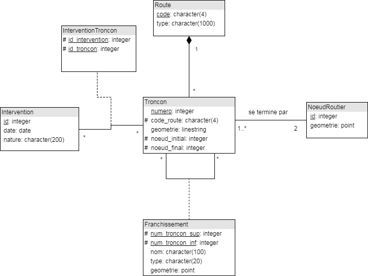


### Exercice 7 ###
1. création de la table Buveur
``` sql
CREATE TABLE Buveur (id integer PRIMARY KEY,
					 nom varchar(50),
					 prenom varchar(50),
					 naissance integer,
					 ville varchar(100));
```

2. suppression de la colonne `naissance` de la table `Buveur`
``` sql
ALTER TABLE Buveur DROP COLUMN naissance;
```

3. ajout de la colonne `naissance` à la table `Buveur` en y ajoutant une contrainte pour qu'un buveur ne puisse pas avoir moins de 18 ans
``` sql
ALTER TABLE Buveur ADD COLUMN naissance integer CHECK naissance <= CURTIME().YEAR() - 18;
```
(si l'instruction `CURTIME().YEAR()` n'est pas connue, il est accepté ici de rentrer l'année en dur dans la requête : `ALTER TABLE Buveur ADD COLUMN naissance integer CHECK naissance <= 1999;`)

4. ajout du *Pinot Noir* dans la table `Cepage`
``` sql
INSERT INTO Cepage (nom) VALUES ('Pinot Noir');
```

5. ajout dans la table des buveurs de Abel Mir, né en 1990 et résidant à Bordeaux
``` sql
INSERT INTO Buveur (nom, prenom, naissance, ville) VALUES ('Mir', 'Abel', 1990, 'Bordeaux');
```

6. affichage des buveurs
``` sql
SELECT * FROM Buveur;
```

7. affichage du nom de cru des vins
``` sql
SELECT cru FROM Vin;
```

8. affichage des buveurs dont le nom est *Mir*
``` sql
SELECT * FROM Buveur WHERE nom = 'Mir';
```

9. affichage des cépages dont le nom commence par un *M*
``` sql
SELECT * FROM Cepage WHERE nom LIKE 'M%';
```

10. affichage du prénom des buveurs nés avant 1992
``` sql
SELECT prenom FROM Buveur WHERE naissance <= 1992;
```

11. affichage des vins et de leur cépage
``` sql
SELECT * 
FROM Vin 
JOIN Cepage ON Vin.id_cepage = Cepage.id;
```

12. affichage du prénom des buveurs ayant participé à la dégustation du *07/05/2015*
``` sql
SELECT Buveur.prenom 
FROM Buveur 
JOIN Degustation ON Buveur.id = Degustation.id_buveur 
WHERE Degustation.date = '07/05/2015';
```

13. affichage du cru des vins dégustés par le buveur d'identifiant 3 à la dégustation du *07/05/2015*
``` sql
SELECT Vin.cru 
FROM Vin 
JOIN Degustation ON Vin.id = Degustation.id_vin
JOIN Buveur ON Degustation.id_buveur = Buveur.id
WHERE Degustation.date = '07/05/2015' AND Buveur.id = 3;
```

14. affichage, pour la dégustation du *07/05/2015*, de la note de chaque dégustation, en les triant dans l'ordre décroissant, avec les nom/prénom du buveur, ainsi que le cru et le millésime du vin
``` sql
SELECT Degustation.note, Buveur.nom, Buveur.prenom, Vin.cru, Vin.millesime
FROM Degustation
JOIN Buveur ON Degustation.id_buveur = Buveur.id
JOIN Vin ON Degustation.id_vin = Vin.id
WHERE Degustation.date = '07/05/2015'
ORDER BY Degustation.note DESC;
```

15. passage de la ville de résidence de Deuf John de *Toulouse* à *Dijon*
``` sql
UPDATE Buveur SET ville = 'Dijon' WHERE nom = 'Deuf' AND prenom = 'John'; 
```

16. suppression des dégustations ayant eu lieu le *12/12/2012*
``` sql
DELETE FROM Degustation WHERE date = '12/12/2012';
```
