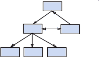
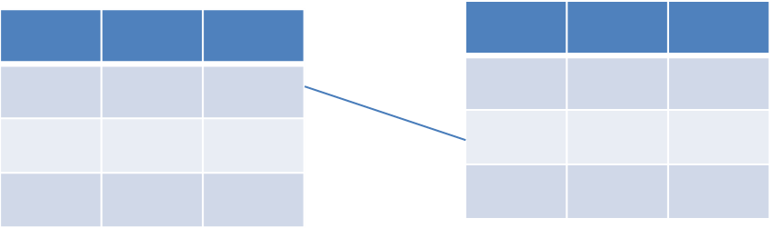
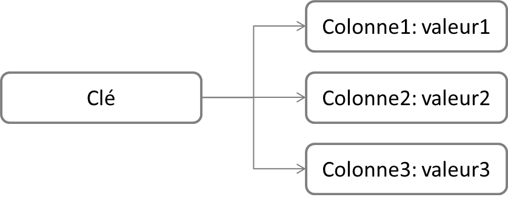
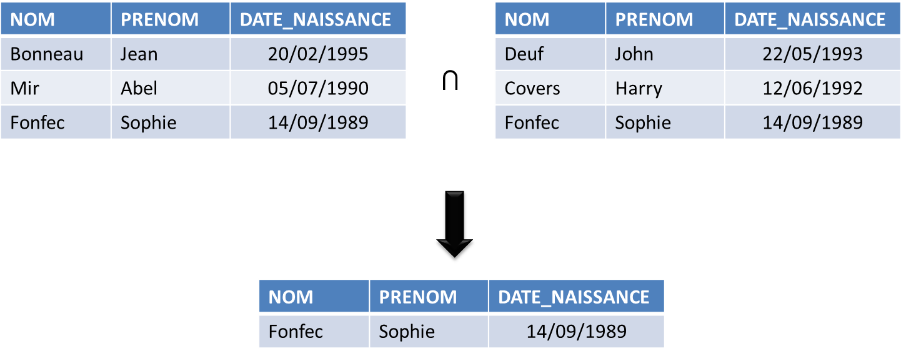
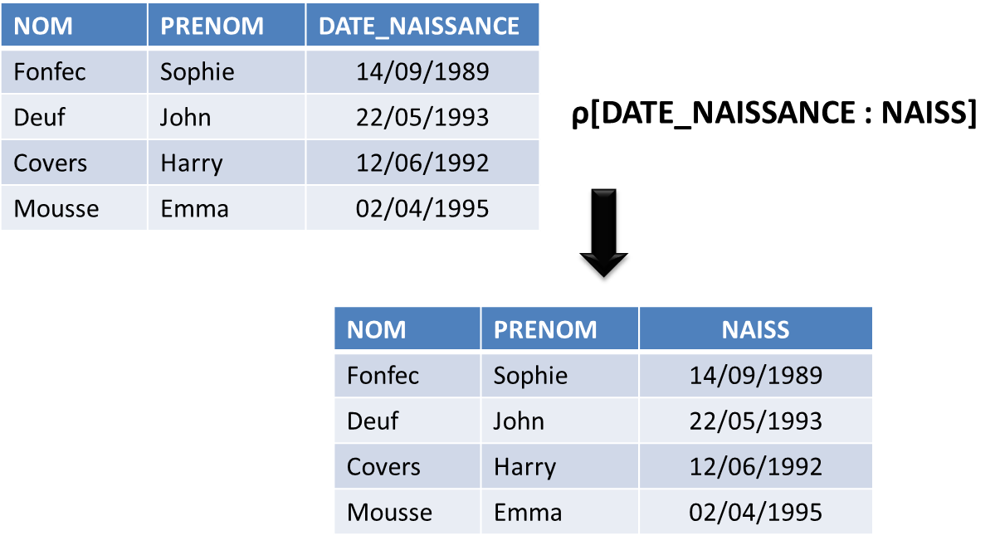
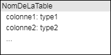
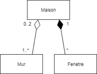
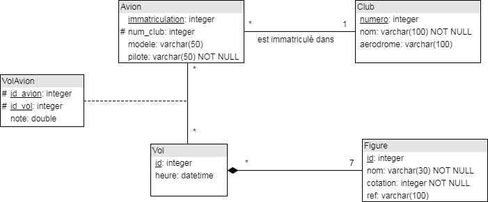

% Bases de données et modélisation
% Division des enseignements en informatique
% 2017

## Objectifs ##

* Savoir ce qu'est une base de données, un SGBD, un SGBDR
* Savoir comment y sont représentées les données
* Connaître les principaux SGBD du marché
* Etre capable de modéliser un problème avec le formalisme UML
* Savoir ce qu'est le language SQL et à quoi il sert

# Les bases de données #

## Qu'est ce qu'une base de données ? ##

## Qu'est ce qu'une base de données ? ##

 

> Une **base de données** est un ensemble de données qui sont stockées sur un support informatique, et structurées de manière à pouvoir facilement consulter et modifier leur contenu.

## Systèmes de Gestion de Bases de Données ##
 

> Le **SGBD** est le logiciel destiné au stockage et à la manipulation de bases de données.

## Pourquoi des BDD et des SGBD ? ##

## Pourquoi des BDD et des SGBD ? ##

* 2 types de mémoire
* Accroissement des volumes stockés
* Accès disques *lents*
* Actions aboutissant à des incohérences
* Optimiser la travail des utilisateurs

## Acteurs des SGBD ##

* Différents profils d'utilisateurs
	* l'expert ou administrateur
	* le développeur ou concepteur
	* l'utilisateur non initié
	
	
## Fonctionnalités d'un SGBD ##

* Fonctionnalités attendues :
	* consultation et modification des données
	* stockage sur un support physique
	* cohérence des données
	* sécurisation des accès
	* gestion des accès multiples
	* reprises sur incidents

	
## Petit historique ##

* 1956 : premier disque dur
* 1964 : apparition du concept de base de données
* 1964 : moteur de base de données réseau IDS de General Electric
* 1966 : moteur de base de données hiérarchique IMS d'IBM
* 1970 : thèse de E. Codd introduisant le modèle relationnel
* 1974 : création du langage SQL
* 1974 : première version de INGRES
* 1975 : modèle entité-association
* 1977 : fondation de la société Oracle

## Aujourd'hui ##

* Multiplication des besoins et des données
	* base de données réparties (1989)
	* base de données orientées objets (1990)
	* NoSQL (1998)

## Utilisateurs de SGBD ##

* Banques
* Sites web marchands
* Réseaux sociaux
* Moteurs de recherche
* Producteurs de données (ex : IGN)
* SIG
* ...

## Les marché des SGBD ##

## Notion de transation ##

> Une **transaction** est une séquence d'actions sur une base de données.

* Etat initial cohérent
* Etat final cohérent
* Contraintes d'intégrité

## Propriétés ACID ##

* 4 propriétés assurant la fiabilité des transactions :
	* Atomicité : une transaction est un ensemble d'instructions indivisibles
	* Cohérence : une transaction ne peut amener à violer une des contraintes de la base
	* Isolation : deux transactions concurrentes ne peuvent intéragir entre elles
	* Durabilité : si une panne survient pendant une transaction, l'ensemble de la transaction doit être annulée
	

## Ordonnancement des transactions ##

# Modélisation d'une base de données #

## Processus de conception ##

1. Description du monde réel
	* *modèle conceptuel*
2. Traduction du modèle dans le SGBD
	* *modèle logique*
3. Implémentation réelle de la BDD
	* *modèle physique*

## Les différents types de modèles ##

* Hiérarchique 

* Réseau 

## Les différents types de modèles ##

* Relationnel 

## Les différents types de modèles ##

* Orienté colonne

## Les différents types de modèles ##

* Orientée document

## Les différents types de modèles ##

* Graphe 

# Le modèle relationnel #

## Généralités ##

* Créé par Codd en 1970
* Repose sur la théorie mathématique des ensembles
* Modèle le plus utilisé actuellement
* **SGBDR** = SGBD Relationnel
* Données de la base de données contenues dans des *relations*

## Exemples de SGBDR ##

## Les relations ##

> Une **relation**, ou *table*, est un ensemble de données relatives au même sujet.

* Sorte de contrat sur la forme attendue des données
* Relations représentées sour forme de tables : en-tête + lignes

## Les colonnes ##

> La **colonne** est le constituant de la relation.

* 1 colonne = 1 *nom* + 1 *domaine*
* **Domaine** : contrainte sur le contenu de la colonne
	* type (texte, nombre, etc.)
	* longueur (20 caractères, 32 bits, etc.)
	* règles (non nul, inférieur à 10, etc.)

## Exemple ##

* La relation VILLE contient trois colonnes nommées :
	* NOM
	* CODE_POSTAL
	* POPULATION
* La représentation classique de la relation est : 
	* VILLE(NOM, CODE_POSTAL, POPULATION)

## Exemple ##

* Le domaine de la colonne NOM est le suivant :
	* Type : texte
	* Longueur : 100 caractères
	* Les caractères autorisés sont les suivants : 0-9, a-z, A-Z, caractères accentuées, espace, "- / ' &"
	* Valeur nulle non autorisée
	* Pas de valeur par défaut

## Exemple ##

* Le domaine de la colonne CODE_POSTAL est le suivant :
	* Type : texte
	* Longueur : 5 caractères
	* Les deux premiers chiffres doivent correspondre à un numéro de département
	* Valeur nulle non autorisée
	* Pas de valeur par défaut

## Exemple ##

* Le domaine de la colonne POPULATION est le suivant :
	* Type : nombre entier
	* Longueur : 32 bits (*valeur max = 4 294 967 295*)
	* Valeur nulle par défaut

## Exemple ##

Table VILLE

| NOM              | CODE_POSTAL | POPULATION  |
|:-----------------|:-----------:|------------:|
| Paris            | 75000       | 2229621     |
| Champs-sur-Marne | 77420       | 24913       |
| Ajaccio          | 2A004       | 67507       |

## Les liens entre relations ##

* Opérations possibles entre relations :
	* Union
	* Intersection
	* Différence
	* Produit cartésien
	* Sélection
	* Projection
	* Renommage
	* Jointure

## L'union ##

* Réunit dans une même relation les éléments communs des deux relations initiales

## L'intersection ##

* Réunit dans une relation les éléments qui sont dans les deux relations initiales

## La différence ##

* Réunit dans une relation les éléments d'une relation donnée qui ne se trouvent pas dans une autre

## Le produit cartésien ##

* Combine dans une relation les éléments de relations en entrée

## La sélection ##

* Sélectionne les éléments d'une relation répondant à une condition

## La projection ##

* Crée une nouvelle relation contenant l'ensemble des lignes d'une relation initiale, mais en ne conservant que certaines colonnes

## Le renommage ##

* Renomme une colonne dans une relation

## La jointure ##

* Composition des éléments de deux relations répondant à un critère de jointure

## Clés et liens entre relations (1/2) ##

> Une **clé primaire** est une colonne, ou un groupe de colonnes, permettant d'identifier de manière unique une ligne.

> Une **clé étrangère** est utilisée pour lier des relations entre elles. Elle fait référence à une clé primaire d'une autre relation.

## Clés et liens entre relations (2/2) ##

* Différents types de liens possibles :
	* **1-1** : *un pays a une capitale, et une capitale est dans un seul pays*
	* **1-N** : *un pays possède plusieurs villes, mais une ville n'est que dans un seul pays*
	* **N-M** : *un pays possède des frontières et ces frontières concernent plusieurs pays*

* **Cardinalité** d'un lien

## Exercices ##

# UML #

## Problématique ##

* Comment établir le modèle conceptuel d'une BDD relationnelle ?
	* outils ?
	* méthodologie ?
	* ... ?

## Problématique ##

* [x] décrire une relation (*Relation(Colonne1, Colonne2...)*)
* [x] décrire un domaine de manière textuelle (*Colonne1 est de type entier, la valeur doit être multiple de 3...*)
* [ ] le faire pour un ensemble de tables de manière concise

## Présentation d'UML (1/2) ##

* UML = Unified Modeling Language
* Utilisé pour tous les aspects de la conception de projets informatiques
* Langage graphique, normalisé, interprétable par un ordinateur

## Présentation d'UML (2/2) ##

* Actuellement en version 2
* 14 diagrammes :

## Diagramme de classe ##

* *Diagramme de base de données*
* Relation représentée sous forme d'un rectangle constitué de deux cases
* Nom de la relation dans la case du haut
* Liste des colonnes dans la case du bas
* Syntaxe pour une colonne : 
	* `nom_colonne: type(longueur) contrainte`

## Clés primaires et étrangères ##

## Différents types de liens ##

* Lien simple
* Agrégation
* Composition

## Différents types de liens ##

## Exemple ##

## Exercices ##

