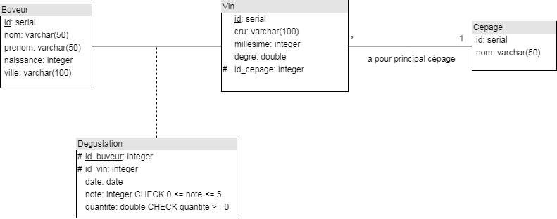
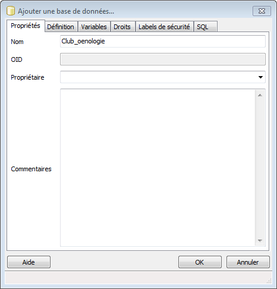
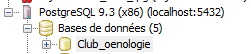
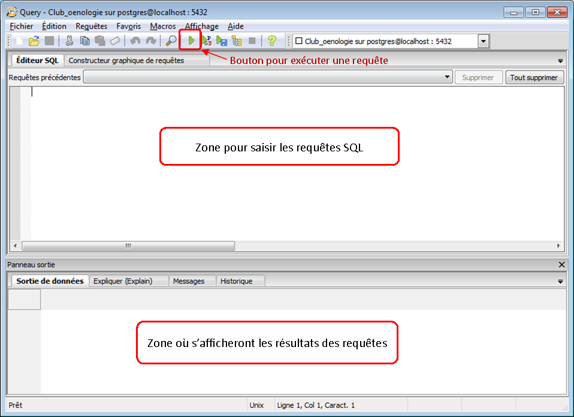

% Le langage SQL
% Division des enseignements en informatique
% 2016


# Le langage SQL #

## Introduction ##

* SQL (*Structured Query Language*)
	* langage de communication avec une BDD relationnelle
	* recherche, ajout, modification, suppression de données
	* créé en 1974
	* normalisé en 1986


## SQL et les SGBD ##

* Implémenté dans la plupart des SGBD
* Mais étendu différemment par chaque SQBD
	* Cours sur SQL de base


## Exercice ##

	Un club d'oenologie souhaite enregistrer les résultats des dégustations qu'il organise avec 
	ces adhérents afin d'effectuer des analyses permettant de proposer les vins les plus appréciés 
	lors des sessions suivantes.
	
	L'association possède le nom, le prénom, l'âge et la ville de résidence de chaque adhérent.
	
	Elle note déjà sur un cahier pour chaque dégustation la date, les participants, les vins 
	dégustés (appelation, millésime, degré, cépage principal, quantité consommée) ainsi que 
	les impressions (sous forme de note allant de 1 à 5).
	
	Proposer une modélisation d'une base de données permettant d'enregistrer ces informations.


## Exercice - schéma relationnel ##

	Buveur (__id__, nom, prenom, naissance, ville)

	Cepage (__id__, nom)

	Vin (__id__, appelation, millesime, degres, id_cepage)
	
	Degustation (__id_b__, __id_v__, date_degust, note, quantite)

* Où :
	* id_b est une clé étrangère vers id de la relation Buveur
	* id_v est une clé étrangère vers id de la relation Vin
	* id_cepage est une clé étrangère vers id de la relation Cepage


## Exercice - schéma conceptuel ##




## Création d'une BDD ##

* Nous utiliserons le SGBD PostgreSQL pour implémenter notre base :
	* Sur votre ordinateur, ouvrez le logiciel PgAdmin
	* Dépliez `PostgreSQL 9.3 (x86) (localhost:5432)`
	* Puis effectuez un clic droit sur `Bases de données` pour *Ajouter une base de données*


## Création d'une BDD ##

* Dans `nom` saisissez *Club_oenologie* et validez pour créer la base




## Exécution de reqêtes SQL ##

* Pour exécuter des reqêtes SQL sur votre base, commencez par vous y connecter :
	* Cliquez sur votre base *Club_oenologie* dans PgAdmin
	* La croix rouge sur l'icône de la base disparait
	* Cliquez ensuite sur le bouton *Exécuter vos propres requêtes SQL*




## Exécution de reqêtes SQL ##

* Nous travaillerons dans la nouvelle fenêtre qui s'ouvre




## Création d'une table ##

* Syntaxe :

``` sql
CREATE TABLE nom_table (colonne1 type1, colonne2 type2...);
```

* Exemple :

``` sql
CREATE TABLE Buveur (id integer PRIMARY KEY, 
                     nom varchar(50), 
                     prenom varchar(50), 
                     naissance integer, 
                     ville varchar(50));
```


## Ajout d'une ligne à une table ##

* Syntaxe :

``` sql
INSERT INTO nom_table (colonneI, colonneJ) VALUES (valeurI, valeurJ);
```

* Exemple :

``` sql
INSERT INTO Buveur (id, nom, prenom, naissance, ville) 
VALUES (1, 'Mir', 'Abel', 1980, 'Bordeaux');
```


## Sélection des éléments d'une table ##

* Syntaxe :

``` sql
SELECT * FROM nom_table;
```

* Exemple : 

``` sql
SELECT * FROM Buveur;
```


## Exercice (1) ##

* Créez la table *Cepage*
* Ajoutez les éléments suivants à la table Cepage
	* (1, Pinot noir)
	* (2, Gamay)
	* (3, Cabernet sauvignon)
	* (4, Merlot)
	* (5, Malbec)
	* (6, Syrah)


## Suppression/ajout d'une colonne ##

* Syntaxe :

``` sql
--suppression--
ALTER TABLE nom_table DROP COLUMN colonne;

--ajout--
ALTER TABLE nom_table ADD COLUMN colonne type;
```

* Exemple :

``` sql
ALTER TABLE Cepage DROP COLUMN id;
ALTER TABLE Cepage ADD COLUMN id serial PRIMARY KEY;
```


## Suppression d'une table ##

* Syntaxe :

``` sql
DROP TABLE nom_table;
```

* Exemple :

``` sql
DROP TABLE Buveur;
```


## Exercice (2) ##

* Recréez la table *Buveur* en utilisant le type `serial` pour la colonne `id`
* Ajoutez les éléments suivants :
	* ('Mir', 'Abel', 1990, 'Bordeaux')
	* ('Bonneau', 'Jean', 1995, 'Paris')
	* ('Fonfec', 'Sophie', 1989, 'Lille')
	* ('Deuf', 'John', 1993, 'Toulouse')
	* ('Covers', 'Harry', 1992, 'Ajaccio')
	* ('Mousse', 'Emma', 1995, 'Paris')
	* ('Mir', 'Jade', 1996, 'Bordeaux')


## Projection ##

* Syntaxe :

``` sql
SELECT colonneI, colonneJ FROM nom_table;
```

* Exemple :

``` sql
SELECT nom, prenom FROM Buveur;
```


## Selection ##

* Syntaxe :

``` sql
SELECT * FROM nom_table WHERE condition;
```

* Exemple :

``` sql
SELECT * FROM Buveur WHERE id = 4;
```


## Exercice (3) ##

1. Affichez les prénoms et années de naissance des buveurs
2. Affichez les noms des cépages
3. Affichez les buveurs dont le nom est Mir
4. Affichez les buveurs dont l'année de naissance est postérieure à 1992
5. Affichez les cépages dont le nom commence par un 'M' 
	* `%` est utilisé pour signifier *n'importe suite de caractères*
	* `_` est utilisé pour signifier *n'importe quel caractère*
	* l'opérateur `like` est utilisé pour tester la ressemblance de chaînes de caractères 
6. Affichez les prénoms des buveurs dont la ville de résidence est Paris


## Suppression d'une ligne ##

* Syntaxe :

``` sql
DELETE FROM nom_table WHERE condition;
```

* Exemple :

``` sql
DELETE FROM Buveur WHERE id = 1;
```


## Modification d'une ligne ##

* Syntaxe :

``` sql
UPDATE nom_table SET colonne = valeur WHERE condition;
```

* Exemple :

``` sql
UPDATE Buveur SET naissance = 2000 WHERE id = 3;
```


## Clé étrangère ##

* Syntaxe :

``` sql
CREATE TABLE nom_table (colonne type REFERENCES autre_table(autre_colonne));
```

* Exemple :

``` sql
CREATE TABLE Vin (id serial PRIMARY KEY, 
                  appelation varchar(100), 
                  millesime integer, 
                  degres float, 
                  id_cepage integer REFERENCES Cepage(id));
```


## Contraintes ##

* Syntaxe :

``` sql
--lors de la création de la table--
CREATE TABLE nom_table (colonne type contrainte);

--ajout ultérieure--
ALTER TABLE nom_table ADD CONSTRAINT nom_contrainte contrainte;
```

* Exemple :

``` sql
DROP TABLE Vin;
CREATE TABLE Vin (id serial PRIMARY KEY, 
                  cru varchar(100) NOT NULL, 
                  millesime integer CHECK (millesime < 2015), 
                  degres float, 
                  id_cepage integer REFERENCES Cepage(id));
```


## Exercice (4) ##

1. Supprimez la table *Cepage* et utilisez les requêtes transmises par le professeur pour la recréer
2. Passez la ville de naissance de Deuf John de Toulouse à Dijon 
3. Ajoutez une contrainte pour interdire les buveurs de moins de 18 ans (né après 1998)
4. Affichez les prénoms des buveurs restants
5. Ajoutez le buveur ('Perret', 'Ines', 2000, 'Marseille')
6. Passez l'année de naissance à 2003 pour les buveurs né dans une ville dont le nom commance par un 'P' 


## Exercice (5) ##

1. Ajoutez des vins à la base (requêtes transmises par le professeur)
2. Affichez le contenu de cette table


## Exercice (6) ##

1. Créez la table Degustation(id_b, id_v, date_degust, note, quantite) où
	* id_b est une clé étrangère vers l'identifiant de la table Buveur
	* id_v est une clé étrangère vers l'identifiant de la table Buveur
	* il ne faut pas oublier d'inclure une clé primaire
2. Insérez les éléments permettant de traduire le fait que le 12/03/2016, Jean, John, Harry et Jade ont dégusté un Haûte Côte de Nuit (10 cl chacun) et lui attribué respectivement les notes 2, 3, 3, 1.
3. John ayant apprécié le vin, s'est finalement resservi 5cl. Mettez à jour la base pour en tenir compte.


## Produit cartésien ##

* Syntaxe :

``` sql
SELECT * FROM nom_table1, nom_table2;
```

* Exemple :

``` sql
SELECT * FROM Vin, Cepage;
```

## Jointure ##

* Syntaxe :

``` sql
SELECT * FROM nom_table_g JOIN nom_table_d ON condition_de_jointure;
```

* Exemple :

``` sql
SELECT * FROM Vin JOIN Cepage ON Vin.id_cepage = Cepage.id;
```

## Exercice (7) ##

1. Affichez les vins dont le cépage principal est la syrah
2. Affichez le nom des appélations des vins dont le cépage principal est le merlot 
3. Affichez les noms des cépages des appélations Saint Aubun et Cornas
4. Affichez les noms des participants à la dégustation du 12/03/2016


## Trier des résultats ##

* Syntaxe :

``` sql
SELECT * FROM nom_table ORDER BY colonneI;
```

* Exemple :

``` sql
SELECT * FROM Buveur ORDER BY nom;
SELECT * FROM Buveur ORDER BY naissance DESC;
```


## Compter des éléments ##

* Syntaxe :

``` sql
SELECT COUNT(*) FROM nom_table WHERE condition;
```

* Exemple :

``` sql
SELECT COUNT(*) FROM Buveur;
```

## Regrouper les résultats ##

* Syntaxe :

``` sql
SELECT colonneI, ... FROM nom_table GROUP BY colonneI;
```

* Exemple :

``` sql
SELECT millesime, COUNT(*) FROM Vin GROUP BY millesime;
SELECT appelation, AVG(degres) FROM Vin GROUP BY appelation;
```

* Fonctions possibles : COUNT(), AVG(), MIN(), MAX(), SUM()


## Exercice (8) ##

1. Affichez le nombre de vins par cepage
2. Affichez les notes moyenne, maximale et minimale attribuées à chacune des appélations
3. Affichez la note moyenne attribuée à chacun des cépages
4. Affichez le total d'alcool consommé par chacun des buveurs, ainsi que le nombre de dégustations, et en les triant par ordre décroissant d'alcool consommé
5. Affichez le meilleur millesime de l'appelation Saint Julien 


## Les vues ##

* **Vue** = table virtuelle définie par une requête
* Syntaxe :

``` sql
CREATE VIEW nom_vue (colonne1, colonne2...) AS (
```

* Exemple :

``` sql
CREATE VIEW vin_cepage (appelation, cepage) AS (
	SELECT vin.appelation, cepage.nom 
	FROM vin JOIM cepage ON vin.id_cepage=cepage.id 
	GROUP BY vin.appelation, cepage.nom
);
SELECT * FROM vin_cepage WHERE cepage = 'Merlot';
```

## Exercice (9) ##

1. Créez une vue contenant le prénom, la quantité d'alcool consommée lors d'une journée de dégustation, la date de cette dégustation et le nombre vins goutés des trois buveurs ayant consommé le plus lors d'une dégustation
2. Affichez votre vue
3. Ajoutez une dégustation avec une quantité suffisante pour faire varier le classement des plus gros buveurs
4. Affichez de nouveau votre vue


## Divers (1) ##

* Création d'une base (avancé) :
	* Utilisation de l'utilitaire createdb.exe (dossier bin du répertoire d'installation de PostgreSQL)
    createbd.exe -p 5432 -h localhost nom_base
	* requête SQL
    CREATEDB nom_base;

* Suppression d'une base :
    dropdb.exe --if-exists nom_base

* Connexion moteur PostgreSQL sans interface graphique PgAdmin :
    psql.exe -d nom_base -h hote -p port -U utilsateur


## Divers (2) ##

* Alias
* Jointures par la gauche / par la droite, interne / externe
* Sous requêtes
* IN
* EXIST / NOT EXIST
* Index


## Création d'une table ##

* Lorsque la requête est exécutée, elle apparait dans le navigateur de PgAdmin.


## Ajout d'une ligne à une table ##

* Dans l'interface générale de PgAdmin, on peut visualiser que la ligne a bien été ajoutée
	* Sélectionnez la table dans le navigateur
	* Cliquez sur le bouton *Afficher le données*


